```mermaid
graph LR
    A[🌱 Started] --> B[🌿 Active]
    B --> C[🌳 Review]
    C --> D[🍃 Complete]
    style B fill:#90EE90
```

# CLAUDE.md

This file provides guidance to Claude Code (claude.ai/code) when working with code in this repository.

## Important: Security Documentation

When making any security-related changes to Salty, you MUST update the Security Changelog in SECURITY.md. This includes:

- New security features or utilities
- Security configuration changes
- New security tests or scanning tools
- Security header modifications
- Cryptographic changes
- Input validation improvements
- Rate limiting changes
- Any security bug fixes

The Security Changelog is located in SECURITY.md under the "📝 Security Changelog" section.

## Initial Setup

### Enable Git Hooks

To prevent formatting issues in CI, enable the pre-commit hook:

```bash
git config core.hooksPath .githooks
```

This will automatically format code before each commit, preventing formatting failures in CI.

## Common Development Commands

### Development

```bash
# Start development server with file watching
deno task dev

# Run production server
deno task start
```

### Release Management

```bash
# Create a patch release (1.2.3 -> 1.2.4)
deno task release:patch

# Create a minor release (1.2.3 -> 1.3.0)
deno task release:minor

# Create a major release (1.2.3 -> 2.0.0)
deno task release:major

# Rollback a release
deno task rollback

# Preview changelog without creating release
deno task changelog
```

### Code Quality

```bash
# Format code according to project standards
deno fmt

# Lint code
deno lint

# Type check ALL TypeScript files
deno check **/*.ts
# Or alternatively:
deno check *.ts scripts/*.ts
```

### Release Automation

Always use the `--skip-confirmation` flag for non-interactive releases:

```bash
deno task release:patch -- --skip-confirmation  # Non-interactive patch release
deno task release:minor -- --skip-confirmation  # Non-interactive minor release
deno task release:major -- --skip-confirmation  # Non-interactive major release
```

### Preflight Checks Before Release

ALWAYS perform these checks before any release:

```bash
# 1. Format all code
deno fmt

# 2. Run linter
deno lint

# 3. Type check ALL TypeScript files (not just server.ts!)
deno check **/*.ts

# 4. Run all tests
deno test

# 5. Run security-specific tests
deno test --allow-env --allow-read security-utils_test.ts
deno test --allow-env salty_security_test.ts

# 6. Check for uncommitted changes
git status

# 7. Verify version.ts exports match server.ts imports
grep "import.*version.ts" server.ts
```

## High-Level Architecture

### Core Application Flow

1. **server.ts** - Main entry point that sets up Express-like middleware chain for security, logging, rate limiting, and routing
2. **salty.ts** - Pure cryptographic functions exposed both as ES6 modules for browser and TypeScript imports for server
3. **logger.ts** - Structured logging with category-based filtering and webhook integration for critical alerts
4. **telemetry.ts** - OpenTelemetry-style tracing for performance monitoring
5. **version.ts** - Auto-generated by Nagare release tool, single source of truth for version metadata

### Security Architecture

- **Client-side encryption**: All crypto operations happen in browser via Web Crypto API
- **Server never sees plaintext**: Only processes encrypted payloads
- **Defense in depth**: Rate limiting (20 req/hour), input validation, security headers (CSP, HSTS)
- **API authentication**: Optional via API_KEY environment variable

### Cryptographic Design

- **Key Derivation**: PBKDF2-SHA512 with 600,000 iterations
- **Encryption**: AES-GCM-256 with 12-byte IV
- **Encoding**: basE91 for compact, portable output
- **Salt**: Server-configured via SALT_HEX environment variable

### Release Workflow

Nagare automates the entire release process:

1. Updates version in deno.json, README.md badges, and regenerates version.ts
2. Creates git tag and GitHub release with changelog
3. Handles rollback if deployment fails
4. Maintains semantic versioning compliance

### Environment Configuration

Required:

- `SALT_HEX`: 32-character hex string (16 bytes) for cryptographic salt

Optional:

- `API_KEY`: Base64 string for API endpoint authentication
- `LOG_LEVEL`: DEBUG, INFO, WARN, ERROR, SECURITY, CRITICAL (default: INFO)
- `LOG_FORMAT`: json or text (default: json)
- `WEBHOOK_URL`: For critical alert notifications
- `NODE_ENV`: development, staging, or production
- `DASH_USER`: Username for admin dashboard authentication
- `DASH_PASS`: Password for admin dashboard authentication

### Key Implementation Details

- **TypeScript transpilation**: Server automatically transpiles salty.ts for browser ES6 modules
- **Multi-language support**: Japanese (/) and English (/en/) with IBM Plex Sans JP font
- **URL pre-population**: Supports URL parameters for database integration workflows
  - `?payload=` - Pre-populate encrypted payload field
  - `?sui=1` - Activate sharing UI mode (hides password generator and strength assessment)
- **Health endpoint**: GET /health provides comprehensive system metrics
- **Static asset serving**: Images served with appropriate MIME types from /img/

## Security & Compliance Standards

### OWASP Top 10 Security Verification

Before implementing any code changes, verify against current OWASP Top 10:

#### A01 - Broken Access Control

- **API Authentication**: Validate API_KEY for all /api/* endpoints when configured
- **Rate Limiting**: Enforce 20 requests/hour per IP to prevent abuse
- **File Access**: Restrict static file serving to specific paths (/img/, /en/, client files)
- **CORS Policy**: Implement restrictive CORS headers for API endpoints

#### A02 - Cryptographic Failures

- **Strong Algorithms**: AES-GCM-256 encryption with PBKDF2-SHA512 (600,000 iterations)
- **Key Management**: SALT_HEX must be cryptographically secure and unique per deployment
- **Client-Side Encryption**: Plaintext never transmitted to or processed by server
- **Secure Random Generation**: Use crypto.getRandomValues() for IV generation
- **No Hardcoded Secrets**: All secrets via environment variables

#### A03 - Injection

- **Input Validation**: Strict validation for payload (1MB) and key (1KB) sizes
- **Content Type Validation**: Enforce application/json for API requests
- **Output Encoding**: Proper HTML escaping in error messages
- **No Dynamic Code Execution**: No eval() or Function() constructor usage
- **Safe URL Parameter Handling**: Sanitize ?payload= parameter input

#### A04 - Insecure Design

- **Separation of Concerns**: Crypto operations isolated in browser, server handles routing only
- **Fail Securely**: Invalid decryption returns null, not error details
- **Defense in Depth**: Multiple security layers (rate limiting, input validation, headers)
- **Minimal Attack Surface**: Limited endpoints, no database, no user accounts

#### A05 - Security Misconfiguration

- **Security Headers**: Comprehensive CSP, HSTS, X-Frame-Options, X-Content-Type-Options
- **Error Handling**: Generic error messages, no stack traces or sensitive data exposure
- **Environment Validation**: Verify required SALT_HEX on startup
- **Secure Defaults**: Production-ready security settings by default
- **No Debug Info**: LOG_LEVEL controls verbosity, no debug info in production

#### A06 - Vulnerable Components

- **Deno Runtime**: Leverage Deno's secure-by-default runtime
- **Minimal Dependencies**: No external npm packages, only Deno std library
- **Regular Updates**: Monitor Deno security advisories
- **Dependency Pinning**: Lock Deno std library versions in imports

#### A07 - Authentication Failures

- **API Key Protection**: Constant-time comparison for API_KEY validation
- **No User Authentication**: Design eliminates user account vulnerabilities
- **Rate Limiting**: Prevent brute force attempts on API endpoints
- **No Session Management**: Stateless design prevents session attacks

#### A08 - Software/Data Integrity Failures

- **Authenticated Encryption**: AES-GCM provides integrity verification
- **No Code Auto-Updates**: Static deployment, no dynamic code loading
- **Version Integrity**: version.ts tracks build metadata and git commit
- **Deployment Validation**: Health endpoint verifies system integrity

#### A09 - Logging/Monitoring Failures

- **Structured Logging**: Category-based logging with security events
- **Security Event Tracking**: Log rate limit violations, API auth failures
- **No Sensitive Data in Logs**: Exclude keys, plaintext, and API tokens
- **Webhook Alerts**: Critical security events sent to configured webhook
- **Health Monitoring**: /health endpoint provides system metrics

#### A10 - Server-Side Request Forgery (SSRF)

- **No External Requests**: Server makes no outbound HTTP requests
- **Static Resources Only**: No dynamic resource fetching
- **Webhook Validation**: Webhook URL validated if configured
- **No User-Controlled URLs**: Server doesn't process user-provided URLs

### Security Review Process

When reviewing or implementing changes:

1. **Crypto First**: Verify cryptographic implementations against best practices
2. **Input Validation**: Check all user inputs for size, type, and content
3. **Error Handling**: Ensure no sensitive data leakage in error messages
4. **Logging Review**: Verify security events are logged without sensitive data
5. **Header Validation**: Confirm security headers are properly set

### Required Security Checks

For every code change:

- Validate input sanitization (payload, key, API requests)
- Verify cryptographic parameter integrity
- Check error messages for information disclosure
- Ensure rate limiting is enforced
- Validate security headers are maintained
- Review logs for sensitive data exposure

### Security Testing Guidelines

- Test with oversized payloads (>1MB) and keys (>1KB)
- Verify rate limiting blocks after 20 requests/hour
- Test API authentication with invalid keys
- Ensure malformed requests return generic errors
- Validate CORS behavior for cross-origin requests
- Test with invalid basE91 encoded payloads

### Commit Message Standards

Use conventional commits with security annotations when applicable:

```
feat: add input validation for API endpoints

InfoSec: Prevents injection attacks and validates request size limits
```

```
fix: improve rate limiting accuracy

InfoSec: Fixes potential bypass in rate limit calculation
```

```
refactor: simplify error handling logic

InfoSec: No security impact - maintains same error disclosure policy
```

Include "InfoSec:" prefix in commit messages when changes affect:

- Input validation or sanitization
- Cryptographic operations
- Authentication/authorization
- Error handling or logging
- Security headers or policies
- Rate limiting or DoS protection

### Critical Development Notes

1. **Security Testing**: When adding features, create corresponding security tests alongside
   functional tests
2. **File Updates**: Always use line-anchored regex patterns to prevent corruption and validate
   inputs
3. **Error Handling**: Provide actionable error messages with suggestions (no sensitive data
   exposure)
4. **Git State**: Many operations require clean git state - validate early and log security events
5. **Pre-flight**: Always run `deno fmt`, `deno check **/*.ts`, `deno lint`, `deno test` before
   staging a commit
6. **Attribution**: Don't add "Generated with Claude Code" or "Co-Authored-By: Claude" to commit
   messages or PRs. The fact that CLAUDE.md is present, makes it obvious that Claude is being used
7. **Git Commits**: Use "conventional commits" style to make commit messages, including sufficient
   detail so that a person reading in the future, will be able to understand what the commit was.
   **InfoSec Impact**: Include an InfoSec comment in commit messages when changes have security
   implications. Format: "InfoSec: [brief description of security impact/consideration]"

   Examples:
   - `feat: add input validation to CLI args\n\nInfoSec: Prevents injection attacks through command line parameters`
   - `fix: update GitHub API token handling\n\nInfoSec: Improves credential security and reduces token exposure risk`
   - `refactor: simplify file processing logic\n\nInfoSec: No security impact - code organization only`
   - `docs: update README installation steps` (no InfoSec comment needed)
8. **Documentation Updates**: After functionality is added, update the markdown documentation
   accordingly
9. **Git Merging**: When merging master changes to an active branch, make sure both branches are
   pulled and up to date first
10. **Security Documentation**: Document all security-related decisions and their rationale for ISO 27001 compliance
11. **TypeScript Strictness**: NEVER use `any` type. The project has strict linting that forbids `any` types. Always use proper types:
    - Use specific interfaces and types from imports
    - Use type assertions properly: `value as SpecificType` not `value as any`
    - This prevents CI failures and ensures type safety
12. **CI Test Considerations**: Some tests may need to be skipped in CI environments. Use:
    ```typescript
    Deno.test({
      ignore: Deno.env.get("CI") === "true",
      name: "Test name",
    }, async (t) => {/* test code */});
    ```
    This is particularly important for tests that require actual git repositories or file system operations that may conflict in CI

## Programming Paradigm & Code Consistency

Salty follows a **hybrid programming paradigm** combining object-oriented and functional programming. See [PROGRAMMING-PARADIGM.md](./PROGRAMMING-PARADIGM.md) for detailed analysis.

### Key Coding Patterns to Follow

#### 1. Cryptographic Operations - Use Pure Functions

All cryptographic operations MUST be implemented as pure functions with no side effects:

```typescript
// ✅ Good - Pure function
export function salty_encrypt(
  message: string,
  key: CryptoKey,
): Promise<string> {
  // No side effects, predictable output
}

// ❌ Bad - Stateful encryption
class Encryptor {
  private state: any;
  encrypt(message: string): Promise<string> {/* uses this.state */}
}
```

#### 2. Infrastructure Components - Use Classes

Logging, tracing, and utilities should use classes with proper encapsulation:

```typescript
// ✅ Good - Class for stateful components
class Logger {
  private config: LoggerConfig;
  private metrics: PerformanceMetrics;

  info(message: string): void {/* ... */}
}

// ✅ Good - Static utility class
class SecurityUtils {
  static createSecurityHeaders(): Headers {/* ... */}
}
```

#### 3. Error Handling - Use Custom Error Classes

Extend Error class for domain-specific errors:

```typescript
// ✅ Good
class ApiError extends Error {
  constructor(message: string, public statusCode: number, public code: string) {
    super(message);
  }
}
```

#### 4. Type Safety - Use TypeScript Features

- Use interfaces for data contracts
- Use enums for constants
- Use generics for reusable components
- Use `as const` for immutable objects

#### 5. Async Patterns

Always use async/await over callbacks or raw promises:

```typescript
// ✅ Good
async function processRequest(req: Request): Promise<Response> {
  const data = await validateRequest(req);
  return createResponse(data);
}
```

#### 6. Module Organization

- One primary export per file
- Group related types/interfaces at the top
- Use named exports over default exports
- Keep files focused on a single responsibility

<!-- AICHAKU:START -->

<!-- AICHAKU:METHODOLOGY:START -->

## 🎯 MANDATORY: Aichaku Integration Rules

YOU ARE REQUIRED TO FOLLOW THESE RULES WITHOUT EXCEPTION:

### 1. Discussion-First Document Creation

**Phase 1: DISCUSSION MODE (Default when methodology keywords detected)**
✅ Acknowledge the methodology context: "🪴 Aichaku: I see you're thinking about [topic]"
✅ Ask clarifying questions to understand the goal
✅ Help shape and refine the idea
❌ DO NOT create any project folders yet
❌ DO NOT create any documents yet

**Phase 2: WAIT FOR EXPLICIT READINESS**
Only create documents when user says:

- "Let's create a project for this"
- "I'm ready to start"
- "Set up the project"
- "Create the documentation"
- Any direct request for project creation

**Phase 3: CREATE NAMED PROJECT (After user signals readiness)**
✅ Confirm name: "🪴 Aichaku: Based on our discussion, creating project: [descriptive-name]"
✅ Create ALL documents in: `.claude/output/active-YYYY-MM-DD-{descriptive-name}/`
✅ Create STATUS.md FIRST
✅ Create methodology-specific documents
✅ Read guides from `~/.claude/methodologies/`

**YOU MUST NEVER:**
❌ Create documents in the project root directory
❌ Create documents in .claude/user/ (that's for customizations)
❌ Ask where to put files (always use .claude/output/)
❌ Create folders before user is ready to formalize

### 2. CRITICAL: DISCUSSION FIRST, THEN CREATE WITHOUT ASKING

**During Discussion Phase:**
✅ DO say: "🪴 Aichaku: I understand you're exploring [topic]. Let me help you think through this..."
✅ DO say: "What specific challenges are you looking to address?"
❌ NEVER say: "Would you like me to create documents for this?"

**Once User Signals Readiness:**
❌ NEVER say: "Would you like me to..."
❌ NEVER say: "Shall I create..."
❌ NEVER say: "Should I go ahead and..."
✅ IMMEDIATELY say: "🪴 Aichaku: Creating project: [descriptive-name]"
✅ IMMEDIATELY say: "Setting up Shape Up documentation..."
✅ IMMEDIATELY say: "Generating sprint planning templates..."

**THE RULE:** Discuss and refine FIRST. Once user signals readiness, CREATE IMMEDIATELY without asking. This provides thoughtful structure while respecting user autonomy.

### 3. Methodology Detection & Discussion

When you hear these keywords, ENTER DISCUSSION MODE:

**Planning Keywords** → Will create in `.claude/output/active-*/` (when ready):

- "shape"/"pitch" → Discuss Shape Up approach → Later: pitch.md
- "sprint"/"scrum" → Discuss Scrum planning → Later: sprint-planning.md
- "kanban"/"board" → Discuss Kanban flow → Later: kanban-board.md
- "mvp"/"lean" → Discuss Lean experiments → Later: experiment-plan.md

**Discussion Mode Actions:**

1. Acknowledge: "🪴 Aichaku: I see you're interested in [methodology]"
2. Read the appropriate guide SILENTLY:
   - `~/.claude/methodologies/[methodology]/[METHODOLOGY]-AICHAKU-GUIDE.md`
   - `~/.claude/methodologies/core/[MODE].md`
3. Ask clarifying questions based on the methodology
4. Help refine the approach
5. WAIT for explicit "create project" signal

### 4. Visual Identity & Progress Indicators

**MANDATORY Visual Identity:**
✅ ALWAYS prefix Aichaku messages with: 🪴 Aichaku:
✅ Use growth phase indicators: 🌱 (new) → 🌿 (active) → 🌳 (mature) → 🍃 (complete)
✅ Show current phase in status updates with **bold** text and arrow: [Planning] → [**Executing**] → [Complete]
▲

**Example Status Display:**

```
🪴 Aichaku: Shape Up Progress
[Shaping] → [**Betting**] → [Building] → [Cool-down]
              ▲
Week 2/6 ████████░░░░░░░░░░░░ 33% 🌿
```

**Methodology Icons:**

- Shape Up: Use 🎯 for betting, 🔨 for building
- Scrum: Use 🏃 for sprints, 📋 for backlog
- Kanban: Use 📍 for cards, 🌊 for flow
- Lean: Use 🧪 for experiments, 📊 for metrics

**NEVER:**
❌ Use garden metaphors in text (no "planting", "growing", "harvesting")
❌ Mix visual indicators (keep consistent within a project)
❌ Overuse emojis (maximum one per concept)

### 5. Mermaid Diagram Integration

**MANDATORY Diagram Creation:**
✅ Include Mermaid diagrams in EVERY project documentation
✅ Add methodology-specific workflow diagrams
✅ Use diagrams to visualize project status

**Required Diagrams by Document:**

**In STATUS.md:**



**In Shape Up pitch.md:**


**In Scrum sprint-planning.md:**


**NEVER:**
❌ Create diagrams without labels
❌ Use complex diagrams when simple ones work
❌ Forget to update diagrams with status changes

### 6. Project Lifecycle Management

**Starting Work:**

1. ⚠️ **CHECK TODAY'S DATE**: Look for "Today's date:" in the environment info
2. Create: `.claude/output/active-YYYY-MM-DD-{descriptive-name}/`
   - YYYY-MM-DD must be TODAY'S actual date from environment
   - Common mistake: Using 01 instead of current month
   - Example if today is 2025-07-10: `active-2025-07-10-project-name/`
3. Create STATUS.md immediately (with status diagram)
4. Read appropriate methodology guides
5. Create planning documents (with workflow diagrams)
6. WAIT for human approval before coding

**During Work:**

- Update STATUS.md regularly (including diagram state)
- Create supporting documents freely
- Start responses with: "🪴 Aichaku: Currently in [mode] working on [task]"

**Completing Work:**

1. Create YYYY-MM-DD-{Project-Name}-CHANGE-LOG.md summarizing all changes
   - ⚠️ Use TODAY'S date from environment info (not example dates!)
   - Example format: 2025-07-10-Fix-Security-Tests-CHANGE-LOG.md
   - Example format: 2025-07-10-Update-Authentication-CHANGE-LOG.md
   - NEVER just "CHANGE-LOG.md" - always include TODAY'S date and descriptive project name
2. Update final diagram states
3. Rename folder: active-* → done-*
4. Ask: "Work appears complete. Shall I commit and push?"
5. Use conventional commits: feat:/fix:/docs:/refactor:

### 7. Git Automation

When work is confirmed complete:

```bash
git add .claude/output/[current-project]/
git commit -m "[type]: [description]

- [what was done]
- [key changes]"
git push origin [current-branch]
```

### 8. Error Recovery

If you accidentally create a file in the wrong location:

1. Move it immediately: `mv [file] .claude/output/active-*/`
2. Update STATUS.md noting the correction
3. Continue without asking

REMEMBER: This is AUTOMATIC behavior. Users expect documents to appear in the right place without asking.

Methodologies: Shape Up, Scrum, Kanban, Lean, XP, Scrumban
Learn more: https://github.com/RickCogley/aichaku

<!-- AICHAKU:METHODOLOGY:END -->

<!-- AICHAKU:DOC-STANDARDS:START -->

## 📝 Selected Documentation Standards

🪴 Aichaku: Based on your project configuration, follow these documentation standards:

### DIATAXIS-GOOGLE

# Diátaxis + Google Developer Documentation Style Guide

## Quick Reference

The Diátaxis framework organizes documentation into four distinct modes, each serving a specific user need. Combined with Google's developer documentation style guide, this creates clear, accessible, and well-structured documentation.

### The Four Modes of Documentation

1. **🎓 Tutorial** - Learning-oriented: Teaching a beginner to do something
2. **🔧 How-to Guide** - Task-oriented: Showing how to solve a specific problem
3. **📖 Reference** - Information-oriented: Describing the machinery
4. **💡 Explanation** - Understanding-oriented: Clarifying and discussing concepts

## Tutorial Guidelines

### Purpose

Tutorials are lessons that take the reader through a series of steps to complete a project. They are learning-oriented.

### Structure

````markdown
# Getting Started with [Product Name]

In this tutorial, you'll learn how to [main outcome]. By the end, you'll have [specific achievement].

## Prerequisites

- [Requirement 1]
- [Requirement 2]

## What you'll learn

- How to [task 1]
- How to [task 2]
- How to [task 3]

## Step 1: [Action]

[Clear instruction with context]

```bash
# Example command
example-command --flag value
```
````

**Expected output:**

```
[Show what success looks like]
```

## Step 2: [Next Action]

[Continue pattern...]

## Summary

You've successfully [what they achieved]. You learned how to:

- [Accomplishment 1]
- [Accomplishment 2]

## Next steps

- Try [related tutorial]
- Explore [related concept]

````
### Google Style Notes for Tutorials

- **Use second person**: "You'll create a service" not "We'll create a service"
- **Present tense**: "The command creates a file" not "The command will create a file"
- **Active voice**: "Configure the server" not "The server should be configured"
- **Clear outcomes**: Start with what the user will achieve
- **Concrete examples**: Use realistic, working examples

## How-to Guide Guidelines

### Purpose
How-to guides are recipes that guide the reader through solving a specific problem. They are task-oriented.

### Structure
```markdown
# How to [Specific Task]

This guide shows you how to [specific task]. Use this approach when you need to [use case].

## Before you begin

Ensure you have:
- [Prerequisite 1]
- [Prerequisite 2]

## Solution

### Option 1: [Approach Name]

Use this approach when [specific condition].

1. [First step]
   ```bash
   command --example
````

2. [Second step]
   ```yaml
   configuration:
     key: value
   ```

### Option 2: [Alternative Approach]

Use this approach when [different condition].

[Steps...]

## Verify your configuration

Test your setup:

```bash
test-command
```

## Troubleshooting

**Problem**: [Common issue]
**Solution**: [How to fix it]

## Related tasks

- [Related how-to 1]
- [Related how-to 2]

````
### Google Style Notes for How-to Guides

- **Start with the goal**: Lead with what the user wants to accomplish
- **Provide context**: Explain when to use each approach
- **Focus on the task**: Don't explain concepts in detail (link to explanations)
- **Include verification**: Show how to confirm success
- **Add troubleshooting**: Address common problems

## Reference Guidelines

### Purpose
Reference guides are technical descriptions of the machinery and how to operate it. They are information-oriented.

### Structure
```markdown
# [Component Name] Reference

## Overview

[Brief description of what this component does]

## Synopsis
````

command [options] [arguments]

````
## Description

[Detailed explanation of the component's purpose and behavior]

## Options

### `--option-name` {#option-name}

**Type**: `string` | `boolean` | `number`  
**Default**: `value`  
**Environment variable**: `ENV_VAR_NAME`

[Description of what this option does]

**Example**:
```bash
command --option-name=value
````

### `--another-option` {#another-option}

[Continue pattern...]

## Arguments

### `argument-name`

**Required**: Yes | No\
**Type**: `string`\
**Valid values**: `value1`, `value2`, `value3`

[Description]

## Examples

### Basic usage

```bash
command basic-argument
```

### Advanced usage

```bash
command --option1=value --option2 complex-argument
```

## Exit codes

| Code | Description       |
| ---- | ----------------- |
| 0    | Success           |
| 1    | General error     |
| 2    | Invalid arguments |

## See also

- [`related-command`](link) - Brief description
- [Configuration guide](link)

````
### Google Style Notes for References

- **Be complete**: Document every option, parameter, and return value
- **Be accurate**: Keep technical details precise and up-to-date
- **Use consistent formatting**: Follow the same structure throughout
- **Include examples**: Show real usage for every feature
- **Cross-reference**: Link to related references and explanations

## Explanation Guidelines

### Purpose
Explanations are understanding-oriented discussions that clarify and illuminate concepts. They provide context and background.

### Structure
```markdown
# Understanding [Concept]

## Overview

[High-level introduction to the concept and why it matters]

## Background

[Historical context or theoretical foundation]

## How [Concept] works

[Detailed explanation with diagrams if helpful]

```mermaid
graph TD
    A[Input] --> B[Process]
    B --> C[Output]
````

## Design decisions

### Why we chose [approach]

[Reasoning and trade-offs]

**Advantages**:

- [Benefit 1]
- [Benefit 2]

**Trade-offs**:

- [Limitation 1]
- [Limitation 2]

## Common patterns

### Pattern 1: [Name]

[When and how to apply this pattern]

### Pattern 2: [Name]

[Continue...]

## Comparison with alternatives

| Approach      | Pros   | Cons   | Best for   |
| ------------- | ------ | ------ | ---------- |
| Our approach  | [List] | [List] | [Use case] |
| Alternative 1 | [List] | [List] | [Use case] |

## Further reading

- [Academic paper or specification]
- [Related explanation in docs]
- [External resource]

````
### Google Style Notes for Explanations

- **Start with why**: Explain why this concept matters to the reader
- **Use analogies carefully**: Ensure they clarify rather than confuse
- **Acknowledge complexity**: Don't oversimplify; link to details
- **Discuss trade-offs**: Be honest about limitations
- **Provide context**: Help readers understand the bigger picture

## General Google Style Guidelines

### Writing Principles

1. **Write for a global audience**
   - Use simple, clear language
   - Avoid idioms and cultural references
   - Define acronyms on first use

2. **Be conversational but professional**
   - Use contractions (you're, it's)
   - Be friendly but not overly casual
   - Maintain technical accuracy

3. **Focus on the user**
   - Address the reader directly
   - Explain what's in it for them
   - Anticipate their questions

### Formatting Standards

#### Headings
- Use sentence case: "Configure the database" not "Configure The Database"
- Make headings descriptive and action-oriented
- Use heading levels consistently

#### Lists
- Use bulleted lists for unordered items
- Use numbered lists for sequential steps
- Keep list items parallel in structure

#### Code Samples
```language
# Include a comment explaining what the code does
actual --code --here
````

- Test all code samples
- Show both input and output when relevant
- Use consistent placeholder names: `YOUR_PROJECT_ID`, `REGION`

#### Links

- Use descriptive link text: "See the [configuration guide]" not "See [here]"
- Link to the specific section when possible
- Check links regularly for accuracy

### Voice and Tone

#### Do

- ✅ "To create a user, run the following command"
- ✅ "If the build fails, check your configuration"
- ✅ "This feature requires version 2.0 or later"
- ✅ "You can configure multiple options"

#### Don't

- ❌ "We need to create a user" (use "you" not "we")
- ❌ "The build might fail" (be specific about conditions)
- ❌ "This feature requires a recent version" (be precise)
- ❌ "There are multiple options available" (be direct)

### Documentation Categories

Ensure your documentation clearly identifies which mode it belongs to:

- **Tutorial**: Prefix with "Tutorial:" or "Getting started with"
- **How-to**: Start with "How to" or "Guide to"
- **Reference**: Use "Reference" or "API documentation"
- **Explanation**: Use "Understanding", "Architecture", or "Concepts"

## Template Usage

1. Choose the appropriate template based on your documentation goal
2. Follow the structure but adapt to your specific needs
3. Maintain consistency across similar documents
4. Review against both Diátaxis principles and Google style guide

Remember: Good documentation serves the reader's needs at their moment of need. Choose the right mode for the right purpose.

---

<!-- AICHAKU:DOC-STANDARDS:END -->

### 1. Discussion-First Document Creation

**Phase 1: DISCUSSION MODE (Default when methodology keywords detected)**
✅ Acknowledge the methodology context: "🪴 Aichaku: I see you're thinking about [topic]"
✅ Ask clarifying questions to understand the goal
✅ Help shape and refine the idea
❌ DO NOT create any project folders yet
❌ DO NOT create any documents yet

**Phase 2: WAIT FOR EXPLICIT READINESS**
Only create documents when user says:

- "Let's create a project for this"
- "I'm ready to start"
- "Set up the project"
- "Create the documentation"
- Any direct request for project creation

**Phase 3: CREATE NAMED PROJECT (After user signals readiness)**
✅ Confirm name: "🪴 Aichaku: Based on our discussion, creating project: [descriptive-name]"
✅ Create ALL documents in: `.claude/output/active-YYYY-MM-DD-{descriptive-name}/`
✅ Create STATUS.md FIRST
✅ Create methodology-specific documents
✅ Read guides from `~/.claude/methodologies/`

**YOU MUST NEVER:**
❌ Create documents in the project root directory
❌ Create documents in .claude/user/ (that's for customizations)
❌ Ask where to put files (always use .claude/output/)
❌ Create folders before user is ready to formalize

### 2. CRITICAL: DISCUSSION FIRST, THEN CREATE WITHOUT ASKING

**During Discussion Phase:**
✅ DO say: "🪴 Aichaku: I understand you're exploring [topic]. Let me help you think through this..."
✅ DO say: "What specific challenges are you looking to address?"
❌ NEVER say: "Would you like me to create documents for this?"

**Once User Signals Readiness:**
❌ NEVER say: "Would you like me to..."
❌ NEVER say: "Shall I create..."
❌ NEVER say: "Should I go ahead and..."
✅ IMMEDIATELY say: "🪴 Aichaku: Creating project: [descriptive-name]"
✅ IMMEDIATELY say: "Setting up Shape Up documentation..."
✅ IMMEDIATELY say: "Generating sprint planning templates..."

**THE RULE:** Discuss and refine FIRST. Once user signals readiness, CREATE IMMEDIATELY without asking. This provides thoughtful structure while respecting user autonomy.

### 3. Methodology Detection & Discussion

When you hear these keywords, ENTER DISCUSSION MODE:

**Planning Keywords** → Will create in `.claude/output/active-*/` (when ready):

- "shape"/"pitch" → Discuss Shape Up approach → Later: pitch.md
- "sprint"/"scrum" → Discuss Scrum planning → Later: sprint-planning.md
- "kanban"/"board" → Discuss Kanban flow → Later: kanban-board.md
- "mvp"/"lean" → Discuss Lean experiments → Later: experiment-plan.md

**Discussion Mode Actions:**

1. Acknowledge: "🪴 Aichaku: I see you're interested in [methodology]"
2. Read the appropriate guide SILENTLY:
   - `~/.claude/methodologies/[methodology]/[METHODOLOGY]-AICHAKU-GUIDE.md`
   - `~/.claude/methodologies/core/[MODE].md`
3. Ask clarifying questions based on the methodology
4. Help refine the approach
5. WAIT for explicit "create project" signal

### 4. Visual Identity & Progress Indicators

**MANDATORY Visual Identity:**
✅ ALWAYS prefix Aichaku messages with: 🪴 Aichaku:
✅ Use growth phase indicators: 🌱 (new) → 🌿 (active) → 🌳 (mature) → 🍃 (complete)
✅ Show current phase in status updates with **bold** text and arrow: [Planning] → [**Executing**] → [Complete]
▲

**Example Status Display:**

```
🪴 Aichaku: Shape Up Progress
[Shaping] → [**Betting**] → [Building] → [Cool-down]
              ▲
Week 2/6 ████████░░░░░░░░░░░░ 33% 🌿
```

**Methodology Icons:**

- Shape Up: Use 🎯 for betting, 🔨 for building
- Scrum: Use 🏃 for sprints, 📋 for backlog
- Kanban: Use 📍 for cards, 🌊 for flow
- Lean: Use 🧪 for experiments, 📊 for metrics

**NEVER:**
❌ Use garden metaphors in text (no "planting", "growing", "harvesting")
❌ Mix visual indicators (keep consistent within a project)
❌ Overuse emojis (maximum one per concept)

### 5. Mermaid Diagram Integration

**MANDATORY Diagram Creation:**
✅ Include Mermaid diagrams in EVERY project documentation
✅ Add methodology-specific workflow diagrams
✅ Use diagrams to visualize project status

**Required Diagrams by Document:**

**In STATUS.md:**


**In Shape Up pitch.md:**


**In Scrum sprint-planning.md:**


**NEVER:**
❌ Create diagrams without labels
❌ Use complex diagrams when simple ones work
❌ Forget to update diagrams with status changes

### 6. Project Lifecycle Management

**Starting Work:**

1. Create: `.claude/output/active-YYYY-MM-DD-{descriptive-name}/`
2. Create STATUS.md immediately (with status diagram)
3. Read appropriate methodology guides
4. Create planning documents (with workflow diagrams)
5. WAIT for human approval before coding

**During Work:**

- Update STATUS.md regularly (including diagram state)
- Create supporting documents freely
- Start responses with: "🪴 Aichaku: Currently in [mode] working on [task]"

**Completing Work:**

1. Create YYYY-MM-DD-{Project-Name}-CHANGE-LOG.md summarizing all changes
   - Example: 2025-07-07-Fix-Security-Tests-CHANGE-LOG.md
   - Example: 2025-07-07-Update-Authentication-CHANGE-LOG.md
   - NEVER just "CHANGE-LOG.md" - always include date and descriptive project name
2. Update final diagram states
3. Rename folder: active-* → done-*
4. Ask: "Work appears complete. Shall I commit and push?"
5. Use conventional commits: feat:/fix:/docs:/refactor:

### 7. Git Automation

When work is confirmed complete:

```bash
git add .claude/output/[current-project]/
git commit -m "[type]: [description]

- [what was done]
- [key changes]"
git push origin [current-branch]
```

### 8. Error Recovery

If you accidentally create a file in the wrong location:

1. Move it immediately: `mv [file] .claude/output/active-*/`
2. Update STATUS.md noting the correction
3. Continue without asking

REMEMBER: This is AUTOMATIC behavior. Users expect documents to appear in the right place without asking.

Methodologies: Shape Up, Scrum, Kanban, Lean, XP, Scrumban
Learn more: https://github.com/RickCogley/aichaku

<!-- AICHAKU:END -->


## Directives for Claude Code from Aichaku

This configuration is dynamically assembled from YAML files in your ~/.claude/aichaku installation.

```yaml
aichaku:
  version: 0.35.4
  source: configuration-as-code
behavioral_directives:
  discussion_first:
    name: Discussion-First Document Creation
    description: A three-phase approach to thoughtful project creation
    phases:
      - name: DISCUSSION MODE
        description: Default when methodology keywords detected
        triggers:
          - shape
          - pitch
          - appetite
          - sprint
          - scrum
          - kanban
          - board
          - mvp
          - lean
          - experiment
        actions:
          required:
            - "Acknowledge the methodology context: '\U0001FAB4 Aichaku: I see you're thinking about [topic]'"
            - Ask clarifying questions to understand the goal
            - Help shape and refine the idea
            - Read appropriate guide SILENTLY from ~/.claude/aichaku/methodologies/
          forbidden:
            - DO NOT create any project folders yet
            - DO NOT create any documents yet
            - 'NEVER say: ''Would you like me to create documents for this?'''
      - name: WAIT FOR READINESS
        description: Only create documents when user signals explicit readiness
        triggers:
          - Let's create a project for this
          - I'm ready to start
          - Set up the project
          - Create the documentation
          - Any direct request for project creation
        actions:
          required:
            - Wait for explicit readiness signal from user
          forbidden:
            - Do not create anything before user signals readiness
      - name: CREATE PROJECT
        description: 'After user signals readiness, create immediately without asking'
        actions:
          required:
            - "Confirm name: '\U0001FAB4 Aichaku: Based on our discussion, creating project: [descriptive-name]'"
            - 'Create ALL documents in: docs/projects/active/YYYY-MM-DD-{descriptive-name}/'
            - Create STATUS.md FIRST
            - Create methodology-specific documents
            - Read guides from ~/.claude/aichaku/methodologies/
          forbidden:
            - NEVER create documents in the project root directory
            - NEVER create documents in .claude/user/
            - NEVER ask where to put files
            - NEVER ask for permission after readiness signal
  critical_behavior:
    name: Critical Behavioral Rules
    rules:
      - name: No asking after readiness
        description: 'Once user signals readiness, CREATE IMMEDIATELY without asking'
        examples:
          do:
            - "\U0001FAB4 Aichaku: Creating project: [descriptive-name]"
            - Setting up Shape Up documentation...
            - Generating sprint planning templates...
          dont:
            - Would you like me to...
            - Shall I create...
            - Should I go ahead and...
      - name: Discussion mode responses
        description: 'During discussion phase, focus on understanding and refinement'
        examples:
          do:
            - "\U0001FAB4 Aichaku: I understand you're exploring [topic]. Let me help you think through this..."
            - What specific challenges are you looking to address?
          dont:
            - Would you like me to create documents for this?
  methodology_detection:
    name: Methodology Detection & Discussion
    description: How to respond when methodology keywords are detected
    planning_keywords:
      shape_up:
        triggers:
          - shape
          - pitch
          - appetite
          - betting
          - cool-down
        discussion_approach: Discuss Shape Up approach
        creates: pitch.md
      scrum:
        triggers:
          - sprint
          - scrum
          - backlog
          - velocity
          - standup
        discussion_approach: Discuss Scrum planning
        creates: sprint-planning.md
      kanban:
        triggers:
          - kanban
          - board
          - WIP
          - flow
          - continuous
        discussion_approach: Discuss Kanban flow
        creates: kanban-board.md
      lean:
        triggers:
          - mvp
          - lean
          - experiment
          - validate
          - pivot
        discussion_approach: Discuss Lean experiments
        creates: experiment-plan.md
    discussion_mode_actions:
      - "Acknowledge: '\U0001FAB4 Aichaku: I see you're interested in [methodology]'"
      - Read the appropriate guide SILENTLY
      - Ask clarifying questions based on the methodology
      - Help refine the approach
      - WAIT for explicit 'create project' signal
  error_recovery:
    name: Error Recovery
    description: How to handle mistakes in file placement
    steps:
      - 'Move file immediately: mv [file] docs/projects/active/*/'
      - Update STATUS.md noting the correction
      - Continue without asking
    principle: >-
      This is AUTOMATIC behavior. Users expect documents to appear in the right place without
      asking.
  git_automation:
    name: Git Automation
    description: How to handle git operations when work is complete
    when: Work is confirmed complete
    commands:
      - 'git add docs/projects/active/[current-project]/'
      - 'git commit -m ''[type]: [description]\n\n- [what was done]\n- [key changes]'''
      - 'git push origin [current-branch]'
    commit_types:
      - feat
      - fix
      - docs
      - refactor
visual_identity:
  prefix:
    mandatory: true
    format: "\U0001FAB4 Aichaku:"
    usage: ALWAYS prefix Aichaku messages with this exact format
  growth_phases:
    description: Project lifecycle indicators
    phases:
      new:
        emoji: "\U0001F331"
        description: New project just started
      active:
        emoji: "\U0001F33F"
        description: Actively being worked on
      mature:
        emoji: "\U0001F333"
        description: In review or maturing
      complete:
        emoji: "\U0001F343"
        description: Completed and archived
    usage: Use these indicators to show project phase in status updates
  progress_display:
    format:
      phase_indicator: '[Phase] → [**Current**] → [Next]'
      arrow_position: Place ▲ under current phase
      progress_bar: 'Week X/Y ████████░░░░░░░░░░░░ XX% [emoji]'
    example: "\U0001FAB4 Aichaku: Shape Up Progress\n[Shaping] → [**Betting**] → [Building] → [Cool-down]\n              ▲\nWeek 2/6 ████████░░░░░░░░░░░░ 33% \U0001F33F\n"
file_organization:
  root: docs/projects/
  description: All Aichaku projects live under this directory
  states:
    active:
      path: docs/projects/active/
      description: Currently active projects
      naming: 'active-YYYY-MM-DD-{descriptive-kebab-case-name}'
      example: active-2025-07-15-security-workflow-modernization
    done:
      path: docs/projects/done/
      description: Completed projects
      naming: 'done-YYYY-MM-DD-{descriptive-kebab-case-name}'
      example: done-2025-07-14-consistent-branding
      transition: Rename from active-* to done-* when complete
methodologies:
  scrum:
    name: Scrum
    triggers: []
    best_for: Predictable delivery
    templates:
      sprint_planning: templates/sprint-planning.md
      sprint_retrospective: templates/sprint-retrospective.md
      user_story: templates/user-story.md
    phases: {}
    integration_url: 'aichaku://methodology/scrum/guide'
  lean:
    name: Lean Startup
    triggers: []
    best_for: New products
    templates: {}
    phases: {}
    integration_url: 'aichaku://methodology/lean/guide'
  shape_up:
    key_concepts:
      - 'Fixed time, variable scope'
      - 6-week cycles with 2-week cooldown
      - Betting table for project selection
      - Shaping work before betting
      - No backlogs or sprints
    cycle_length: 6 weeks
    best_for: Complex features
    templates:
      - pitch.md
      - cycle-plan.md
      - execution-plan.md
      - hill-chart.md
      - change-summary.md
  scrumban:
    name: Scrumban
    triggers: []
    best_for: Hybrid teams
    templates:
      planning_trigger: templates/planning-trigger.md
    phases: {}
    integration_url: 'aichaku://methodology/scrumban/guide'
  kanban:
    name: Kanban
    triggers: []
    best_for: Ongoing support
    templates:
      kanban_board: templates/kanban-board.md
      flow_metrics: templates/flow-metrics.md
    phases: {}
    integration_url: 'aichaku://methodology/kanban/guide'
  xp:
    name: Extreme Programming
    triggers: []
    best_for: Code quality
    templates: {}
    phases: {}
    integration_url: 'aichaku://methodology/xp/guide'
  shape-up:
    name: Shape Up
    triggers: []
    best_for: Complex features
    templates:
      pitch: templates/pitch.md
      cycle_plan: templates/cycle-plan.md
      execution_plan: templates/execution-plan.md
      hill_chart: templates/hill-chart.md
      change_summary: templates/change-summary.md
    phases: {}
    integration_url: 'aichaku://methodology/shape-up/guide'
standards:
  owasp-web:
    name: OWASP Top 10 Web Application Security
    category: security
    summary:
      critical: |
        - A01: Broken Access Control - Validate authorization on EVERY request
        - A02: Cryptographic Failures - Use strong encryption, secure key management
        - A03: Injection - Parameterized queries, input validation, output encoding
        - A07: Authentication Failures - Strong auth, proper session management
        - A09: Logging Failures - Log security events WITHOUT sensitive data
      security_headers: 'X-Content-Type-Options, X-Frame-Options, HSTS, CSP'
      input_validation: 'Never trust user input - validate, sanitize, escape'
      error_handling: 'Generic error messages, log details server-side only'
    integration_url: 'aichaku://standard/security/owasp-web'
  nist-csf:
    name: NIST Cybersecurity Framework (CSF 2.0)
    category: security
    summary:
      critical: |
        - Govern: Establish cybersecurity governance and risk management
        - Identify: Understand risks to systems, people, assets, data
        - Protect: Implement safeguards for critical services
        - Detect: Identify occurrence of cybersecurity events
        - Respond: Take action on detected incidents
        - Recover: Restore capabilities after incidents
      risk_based: Focuses on risk management over compliance
      scalable: Applicable to organizations of all sizes
      implementation: Code-based policies and automated controls
    integration_url: 'aichaku://standard/security/nist-csf'
  solid:
    name: SOLID Principles
    category: development
    summary:
      critical: |
        - S: Single Responsibility - One reason to change per class
        - O: Open/Closed - Open for extension, closed for modification
        - L: Liskov Substitution - Subtypes must be substitutable
        - I: Interface Segregation - Many specific interfaces > one general
        - D: Dependency Inversion - Depend on abstractions, not concretions
      object_oriented: Core principles for maintainable OOP design
      flexibility: Enables code extension without modification
      testability: Promotes dependency injection and mocking
    integration_url: 'aichaku://standard/development/solid'
  tdd:
    name: Test-Driven Development
    category: development
    summary:
      critical: |
        - Write failing tests FIRST before any implementation
        - Follow Red-Green-Refactor cycle strictly
        - Test behavior, not implementation details
        - One assertion per test for clarity
        - Use dependency injection for testability
      test_structure: AAA (Arrange-Act-Assert) pattern
      naming: Descriptive test names that explain the behavior
      coverage: Aim for 80%+ coverage with meaningful tests
      mocking: 'Mock external dependencies, not internal implementation'
      cycle_discipline: 'Tests must fail initially, minimal implementation to pass, refactor without breaking'
      isolation_requirements: 'Tests run independently, no shared state, any execution order'
      ci_integration: 'All tests pass before merge, coverage reports generated, visible in PRs'
      test_naming_patterns: 'should [behavior] when [condition], returns [result] for [scenario]'
    integration_url: 'aichaku://standard/development/tdd'
  conventional-commits:
    name: Conventional Commits
    category: development
    summary:
      critical: |
        - Format: <type>[optional scope]: <description>
        - Primary types: feat, fix, docs, style, refactor, test, chore
        - Breaking changes: Use ! or BREAKING CHANGE footer
        - Imperative mood: "add feature" not "added feature"
        - 50 char subject limit, 72 char body line limit
      automation: Enables semantic versioning and changelog generation
      version_bumping: 'fix=patch, feat=minor, breaking=major'
      infosec_comment: 'Use InfoSec: prefix for security implications'
    integration_url: 'aichaku://standard/development/conventional-commits'
  clean-arch:
    name: Clean Architecture
    category: architecture
    summary:
      critical: |
        - Dependency Rule: Dependencies point inward toward higher-level policies
        - Four layers: Entities, Use Cases, Interface Adapters, Frameworks/Drivers
        - Business logic independent of frameworks, UI, and databases
        - Testable without external dependencies
        - Enables flexible technology choices
      independence: 'Framework, UI, Database, and External agency independence'
      testability: Business rules testable in isolation
      dependency_direction: Always inward toward business logic
    integration_url: 'aichaku://standard/architecture/clean-arch'
  test-pyramid:
    name: Test Pyramid
    category: testing
    summary:
      critical: |
        - Unit Tests (Base): Many, fast, isolated tests of individual components
        - Integration Tests (Middle): Some, moderate speed, test component interactions
        - E2E Tests (Top): Few, slow, comprehensive user journey tests
        - Pyramid shape: More unit tests, fewer integration, minimal E2E
        - Fast feedback from unit tests, confidence from E2E tests
      distribution: '70% unit, 20% integration, 10% E2E'
      speed: 'Unit tests <1s, Integration <10s, E2E <60s'
      maintenance: Lower levels easier to maintain and debug
      unit_characteristics: 'Pure functions, no external dependencies, milliseconds execution, deterministic'
      integration_scope: 'Database operations, API endpoints, service interactions, real test services'
      e2e_focus: 'Critical user journeys only, production-like environment, browser automation'
      anti_patterns: >-
        Ice cream cone (too many E2E), Hourglass (missing integration), Testing trophy
        (integration-heavy alternative)
      tools_by_layer: 'Unit: Jest/PyTest/JUnit, Integration: Supertest/TestContainers, E2E: Playwright/Cypress'
    integration_url: 'aichaku://standard/testing/test-pyramid'
  diataxis-google:
    name: Diátaxis + Google Developer Documentation Style
    category: documentation
    summary:
      critical: |
        - Four documentation modes: Tutorial, How-to, Reference, Explanation
        - Tutorial: Learning-oriented, step-by-step lessons
        - How-to: Task-oriented, problem-solving recipes
        - Reference: Information-oriented, complete specification
        - Explanation: Understanding-oriented, concept clarification
      google_style: 'Second person, present tense, active voice, clear outcomes'
      user_centered: Different modes serve different user needs and contexts
      separation: Keep modes separate - don't mix tutorial and reference
    integration_url: 'aichaku://standard/documentation/diataxis-google'
included:
  core: true
  methodologies:
    - scrum
    - lean
    - shape-up
    - scrumban
    - kanban
    - xp
  standards:
    - owasp-web
    - nist-csf
    - solid
    - tdd
    - conventional-commits
    - clean-arch
    - test-pyramid
  doc_standards:
    - diataxis-google
  has_user_customizations: false
```
