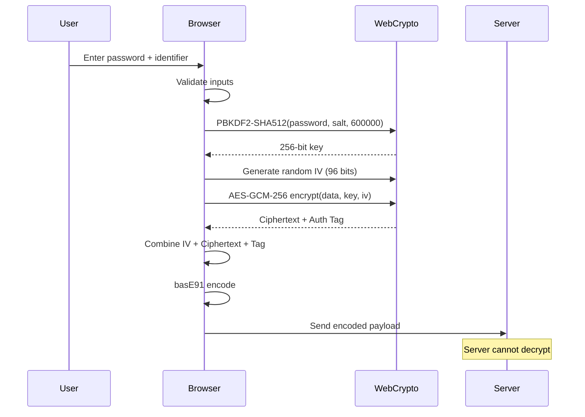
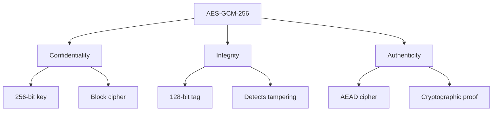
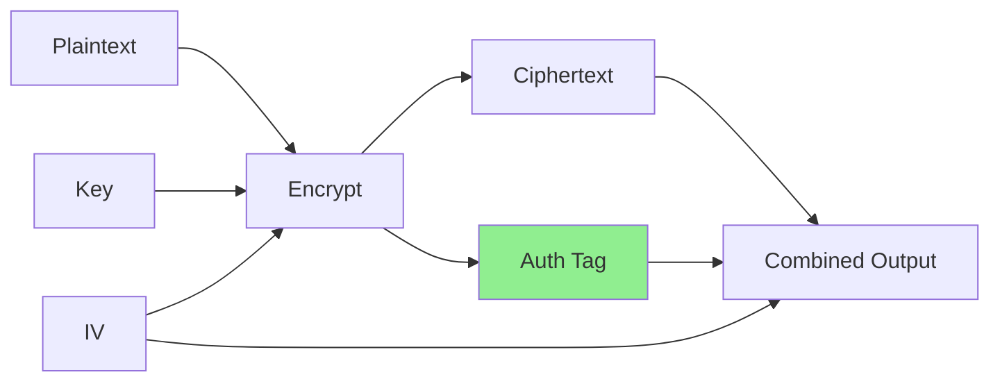
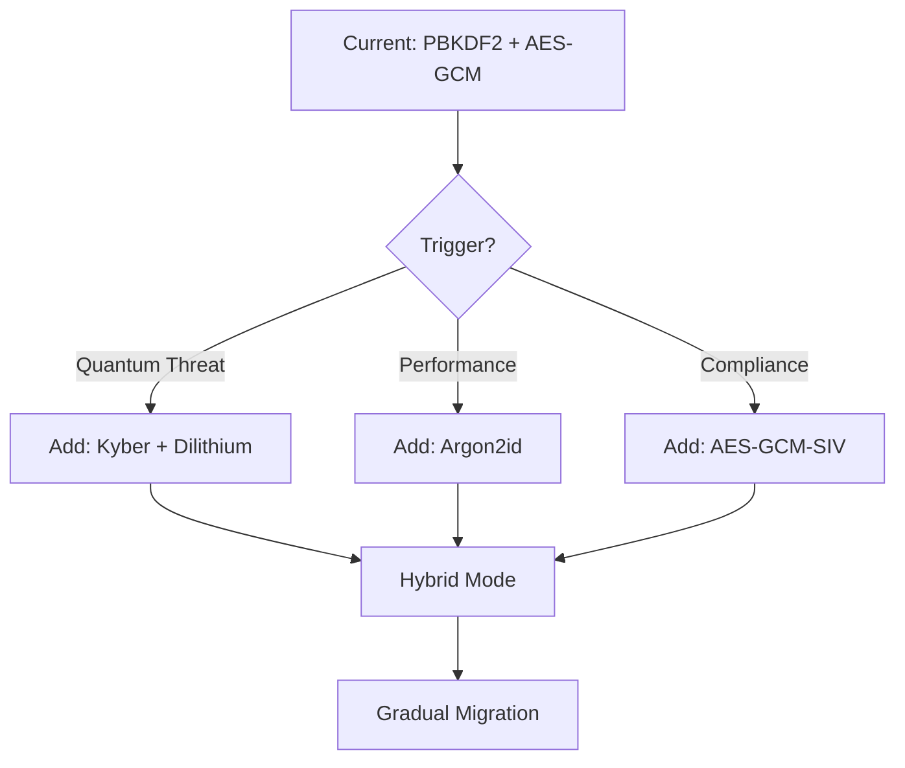

# Cryptographic Design

## Overview

This document provides a detailed explanation of Salty's cryptographic implementation, including algorithm choices, parameter selection, and security considerations. Understanding these details helps security auditors, developers, and users verify the system's security properties.

## Background

Modern cryptography requires careful selection of algorithms, parameters, and implementation details. A single mistake can compromise the entire system. Salty's design prioritizes:

1. **Proven algorithms**: Only NIST-approved, well-analyzed algorithms
2. **Conservative parameters**: Exceeding current security recommendations
3. **Defense in depth**: Multiple layers of protection
4. **Future-proofing**: Preparing for advances in computing power

## How Salty's Cryptography Works

### The Complete Cryptographic Flow



### Key Derivation Function (KDF)

#### PBKDF2-SHA512 Details

```typescript
async function deriveKey(password: string, salt: Uint8Array): Promise<Uint8Array> {
  const encoder = new TextEncoder();
  const passwordBuffer = encoder.encode(password);
  
  // Import password as key material
  const keyMaterial = await crypto.subtle.importKey(
    'raw',
    passwordBuffer,
    { name: 'PBKDF2' },
    false,
    ['deriveBits']
  );
  
  // Derive 256-bit key
  const derivedBits = await crypto.subtle.deriveBits(
    {
      name: 'PBKDF2',
      salt: salt,
      iterations: 600000,
      hash: 'SHA-512'
    },
    keyMaterial,
    256 // bits
  );
  
  return new Uint8Array(derivedBits);
}
```

**Why these parameters?**

- **SHA-512**: Better GPU resistance than SHA-256
- **600,000 iterations**: ~2 seconds on modern CPU
- **256-bit output**: Matches AES-256 key size
- **Fixed salt**: Enables deterministic derivation

### Encryption Algorithm

#### AES-GCM-256 Implementation

```typescript
async function encryptAESGCM(
  plaintext: Uint8Array,
  key: Uint8Array,
  iv: Uint8Array
): Promise<Uint8Array> {
  // Import the key
  const cryptoKey = await crypto.subtle.importKey(
    'raw',
    key,
    { name: 'AES-GCM', length: 256 },
    false,
    ['encrypt']
  );
  
  // Encrypt with authentication
  const ciphertext = await crypto.subtle.encrypt(
    {
      name: 'AES-GCM',
      iv: iv,
      tagLength: 128 // bits
    },
    cryptoKey,
    plaintext
  );
  
  return new Uint8Array(ciphertext);
}
```

**Security properties**:



### Randomness Generation

#### Initialization Vector (IV) Generation

```typescript
function generateSecureIV(): Uint8Array {
  // 96 bits (12 bytes) for GCM
  return crypto.getRandomValues(new Uint8Array(12));
}
```

**Critical requirements**:
- Must be unique for each encryption
- Must be unpredictable
- 96 bits optimal for GCM mode
- Uses browser's CSPRNG

## Design Decisions

### Why Not Argon2?

While Argon2 is the modern standard for password hashing, we chose PBKDF2 because:

1. **Browser support**: Native WebCrypto API support
2. **No dependencies**: Argon2 requires WASM or JavaScript implementation
3. **Sufficient security**: 600k iterations provides adequate protection
4. **Performance predictability**: Consistent across platforms

**Comparison**:

| Algorithm | Memory Hard | Time Cost | Browser Support | Implementation |
|-----------|------------|-----------|-----------------|----------------|
| PBKDF2-SHA512 | ❌ No | Adjustable | ✅ Native | WebCrypto API |
| Argon2id | ✅ Yes | Adjustable | ❌ Limited | WASM/JS |
| scrypt | ✅ Yes | Fixed ratio | ❌ Limited | JavaScript |
| bcrypt | ⚠️ Partial | Adjustable | ❌ None | JavaScript |

### Why Not XChaCha20-Poly1305?

ChaCha20-Poly1305 is an excellent cipher, but:

1. **Standardization**: AES-GCM is NIST approved
2. **Hardware acceleration**: AES-NI instructions
3. **Browser support**: Universal WebCrypto support
4. **Compliance**: Required for many regulations

### Why Fixed Salt?

Using a fixed, server-configured salt enables:

1. **Deterministic derivation**: Same password → same key
2. **No storage required**: Stateless operation
3. **Simplified architecture**: No user salt management
4. **Unique per deployment**: Each instance has different salt

**Security consideration**: The salt prevents rainbow tables but isn't secret. Security comes from the password entropy and iteration count.

## Common Cryptographic Patterns

### Authenticated Encryption



GCM mode provides built-in authentication:
- Encryption and authentication in one pass
- 128-bit authentication tag
- Prevents padding oracle attacks
- Detects any tampering

### Key Stretching Economics

```python
# Attack cost calculation
iterations = 600_000
guesses_per_second = 1_000_000  # High-end GPU
seconds_per_guess = iterations / guesses_per_second  # 0.6 seconds

# For 8-character password with 72 possible characters
password_space = 72**8  # 7.2 × 10^14
time_to_crack = password_space * seconds_per_guess
years_to_crack = time_to_crack / (365 * 24 * 3600)  # ~13,700 years
```

### Constant-Time Operations

Avoiding timing attacks:

```typescript
function constantTimeCompare(a: Uint8Array, b: Uint8Array): boolean {
  if (a.length !== b.length) return false;
  
  let result = 0;
  for (let i = 0; i < a.length; i++) {
    result |= a[i] ^ b[i];
  }
  
  return result === 0;
}
```

## Implementation Security

### WebCrypto API Usage

Benefits of WebCrypto:
1. **Native implementation**: Not JavaScript
2. **Secure key storage**: Keys not accessible to JS
3. **CSPRNG access**: Cryptographically secure randomness
4. **Timing attack resistance**: Native code

### Memory Security

```typescript
// WebCrypto handles secure memory internally
const key = await crypto.subtle.importKey(
  'raw',
  keyMaterial,
  { name: 'AES-GCM' },
  false,  // not extractable
  ['encrypt', 'decrypt']
);

// Key material is protected by the browser
// JavaScript cannot access the actual key bytes
```

### Error Handling

```typescript
async function safeDecrypt(
  ciphertext: string,
  password: string
): Promise<string | null> {
  try {
    // Attempt decryption
    return await decrypt(ciphertext, password);
  } catch (error) {
    // Don't leak information about failure type
    console.error('Decryption failed');
    return null;
  }
}
```

## Cryptographic Agility

### Current Algorithm Suite

```yaml
Version: 1.0
KDF:
  Algorithm: PBKDF2
  Hash: SHA-512
  Iterations: 600000
  DerivedKeyLength: 256 bits
  
Cipher:
  Algorithm: AES-GCM
  KeySize: 256 bits
  IVSize: 96 bits
  TagSize: 128 bits
  
Encoding:
  Algorithm: basE91
  Alphabet: Custom safe set
```

### Migration Path

Future algorithm updates:



### Version Negotiation

```typescript
interface CryptoVersion {
  version: number;
  kdf: 'PBKDF2' | 'Argon2id';
  cipher: 'AES-GCM' | 'XChaCha20-Poly1305';
  iterations?: number;
  memory?: number;
}

// Future: Include version in payload
function encodeWithVersion(
  data: Uint8Array,
  version: CryptoVersion
): string {
  const header = encodeVersion(version);
  return basE91.encode(concat(header, data));
}
```

## Security Analysis

### Strength Calculation

For a 12-character password from 72-character set:
- **Entropy**: 12 × log₂(72) ≈ 74 bits
- **PBKDF2 work factor**: 2^19.2 (600k iterations)
- **Total work**: ~2^93 operations
- **Time at 10^9 guess/sec**: ~315,000 years

### Attack Resistance

| Attack Type | Protection Mechanism | Strength |
|-------------|---------------------|----------|
| Brute Force | PBKDF2 iterations | 600,000 iterations |
| Dictionary | User password + salt | Depends on password |
| Rainbow Tables | Unique salt per deployment | Infeasible |
| Timing Attacks | WebCrypto implementation | Native protection |
| Padding Oracle | GCM authenticated encryption | Not vulnerable |
| Related Key | AES design | 256-bit security |
| Quantum (Grover's) | Key size | 128-bit post-quantum |

### Compliance

Meets requirements for:
- **NIST SP 800-131A**: Approved algorithms
- **FIPS 140-2**: When using certified browser
- **PCI DSS**: Strong cryptography requirement
- **HIPAA**: Encryption safe harbor
- **GDPR**: Appropriate technical measures

## Best Practices Applied

1. **No Custom Crypto**: Only standard algorithms
2. **Secure Defaults**: Strong parameters out of the box
3. **Forward Secrecy**: Each operation independent
4. **Fail Closed**: Errors don't leak information
5. **Defense in Depth**: Multiple security layers

## Known Limitations

1. **Browser Dependency**: Security relies on browser implementation
2. **No Key Escrow**: Lost passwords cannot be recovered
3. **Side Channels**: JavaScript timing attacks possible
4. **Memory Disclosure**: Browser memory dumps could expose data
5. **Quantum Future**: Will need post-quantum algorithms

## Further Reading

- [Security Architecture](./security-architecture.md) - Overall security design
- [Threat Model](./threat-model.md) - Detailed threat analysis
- [Performance Considerations](./performance.md) - Crypto performance impact
- [NIST SP 800-175B](https://doi.org/10.6028/NIST.SP.800-175B) - Cryptographic Standards