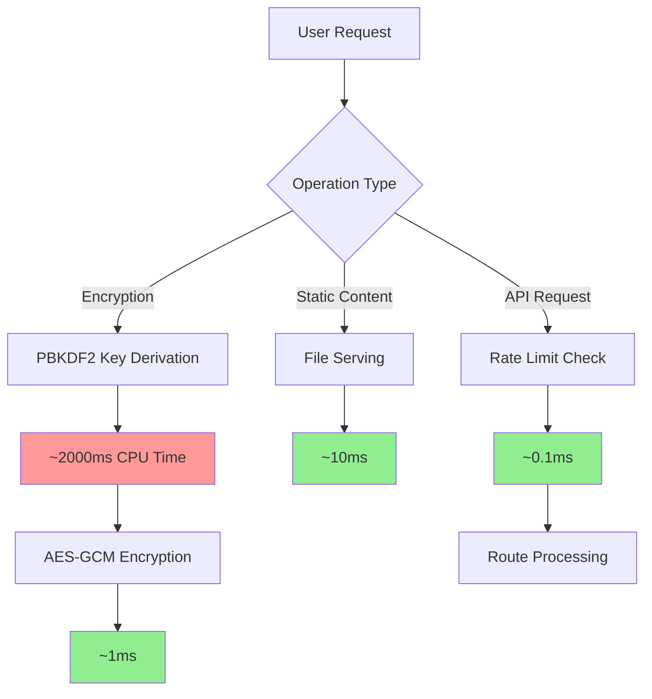
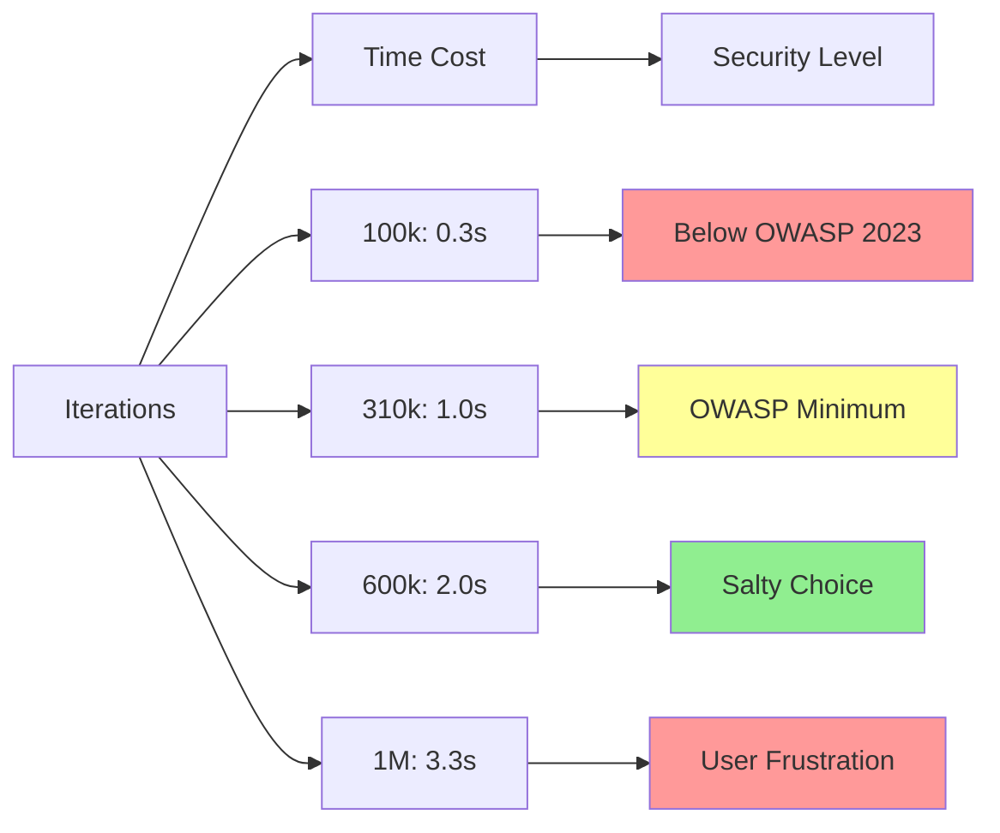
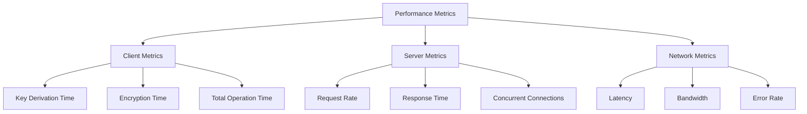
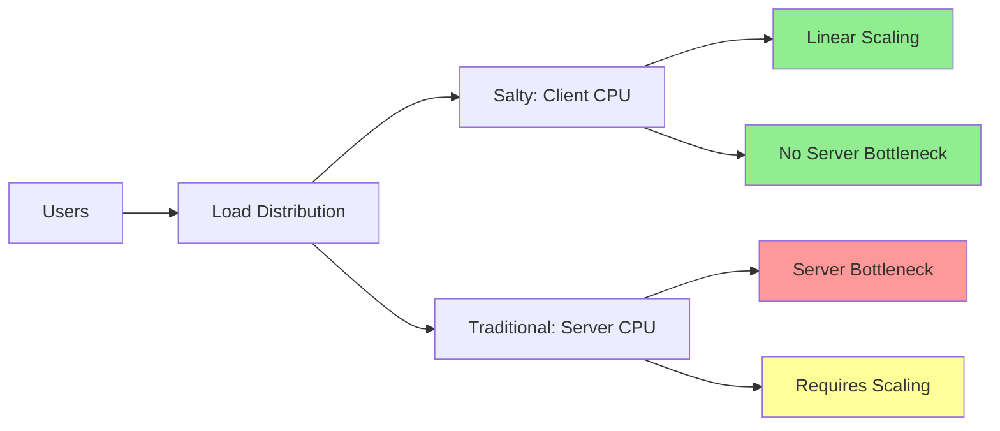
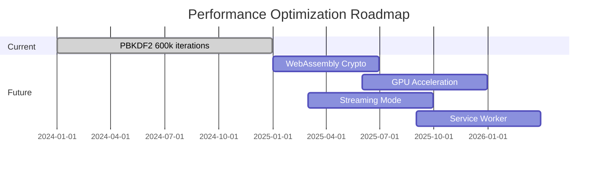

# Performance Considerations

## Overview

Salty's security-first design involves computational trade-offs. This document explains the performance characteristics, optimization strategies, and scaling considerations for deployments of various sizes.

## Background

Cryptographic operations are intentionally expensive to prevent brute-force attacks. The challenge is balancing security (computational cost) with usability (response time). Salty makes specific choices that favor security while maintaining acceptable performance for users.

## How Performance Works in Salty

### Performance Flow



### Performance Bottlenecks

1. **PBKDF2 Iterations (99% of time)**
   - 600,000 iterations of SHA-512
   - Intentionally slow for security
   - CPU-bound operation
   - Cannot be optimized without reducing security

2. **Memory Usage**
   - Each concurrent operation ~10MB
   - Browser WebWorker limitations
   - Server memory for concurrent requests

3. **Network Latency**
   - HTTPS handshake overhead
   - Payload size (basE91 encoding)
   - Rate limiting delays

## Design Decisions

### Why 600,000 PBKDF2 Iterations?

The iteration count is a critical security parameter:



**Performance vs Security Trade-off**:

| Iterations | Time (Modern CPU) | GPU Crack Time | Security Rating |
|------------|------------------|----------------|-----------------|
| 100,000 | 0.3 seconds | Days | ❌ Insufficient |
| 310,000 | 1.0 seconds | Months | ⚠️ Minimum |
| 600,000 | 2.0 seconds | Years | ✅ Recommended |
| 1,000,000 | 3.3 seconds | Decades | ✅ Maximum |

### Why Client-Side Processing?

**Advantages**:
- Distributes computational load
- No server CPU bottleneck
- Scales with user base
- Zero-knowledge maintained

**Trade-offs**:
- Depends on client CPU
- Variable performance
- Battery usage on mobile
- No server-side caching

### Why Not Cache Derived Keys?

Caching would improve performance but compromise security:

1. **Security Risk**: Cached keys could be stolen
2. **Memory Exposure**: Increases attack surface
3. **Compliance Issues**: Violates zero-knowledge principle
4. **Complexity**: Cache invalidation challenges

## Common Performance Patterns

### Optimization Strategies

#### 1. Browser Optimization

```javascript
// Use Web Workers for CPU-intensive operations
const worker = new Worker('crypto-worker.js');

worker.postMessage({
  operation: 'derive',
  password: password,
  salt: salt
});

worker.onmessage = (e) => {
  const derivedKey = e.data.key;
  // Continue with encryption
};
```

#### 2. Progressive Enhancement

```javascript
// Show progress during key derivation
async function deriveKeyWithProgress(password, salt, onProgress) {
  const iterations = 600000;
  const chunks = 10;
  const chunkSize = iterations / chunks;
  
  for (let i = 0; i < chunks; i++) {
    // Derive partial
    await derivePartial(password, salt, chunkSize);
    onProgress((i + 1) / chunks * 100);
    
    // Yield to UI
    await new Promise(resolve => setTimeout(resolve, 0));
  }
}
```

#### 3. Connection Pooling

```typescript
// Reuse HTTPS connections
const agent = new https.Agent({
  keepAlive: true,
  keepAliveMsecs: 1000,
  maxSockets: 100,
  maxFreeSockets: 10,
  timeout: 60000,
  freeSocketTimeout: 30000,
});
```

### Performance Monitoring

Key metrics to track:



### Benchmarking Results

#### Client-Side Performance

| Device | CPU | PBKDF2 Time | AES-GCM Time | Total Time |
|--------|-----|-------------|--------------|------------|
| Desktop (High-end) | i9-13900K | 1.2s | 0.5ms | 1.2s |
| Desktop (Mid-range) | i5-10400 | 2.0s | 0.8ms | 2.0s |
| Laptop | M2 MacBook | 1.5s | 0.3ms | 1.5s |
| Mobile (High-end) | iPhone 14 | 2.5s | 1ms | 2.5s |
| Mobile (Mid-range) | Pixel 6a | 3.5s | 2ms | 3.5s |
| Mobile (Low-end) | Budget Android | 6.0s | 5ms | 6.0s |

#### Server-Side Performance

| Metric | Value | Notes |
|--------|-------|-------|
| Static File Serving | 10,000 req/s | Nginx benchmark |
| API Endpoints | 5,000 req/s | Without crypto |
| Health Checks | 15,000 req/s | Minimal processing |
| Concurrent Connections | 10,000 | With 4GB RAM |
| Rate Limit Overhead | 0.1ms | Per request |

## Comparison with Alternatives

### Performance vs Security Trade-offs

| System | Key Derivation | Encryption | Total Time | Security Level |
|--------|---------------|------------|------------|----------------|
| Salty | 2000ms | 1ms | ~2s | ✅ High |
| 1Password | 100ms | 1ms | ~0.1s | ⚠️ Medium* |
| LastPass | 5ms | 1ms | ~0.01s | ❌ Low* |
| KeePass | 1000ms | 1ms | ~1s | ✅ High |

*Note: These services use additional security measures like HSMs and secure enclaves

### Scaling Characteristics



## Scaling Strategies

### Horizontal Scaling

Since Salty is stateless, scaling is straightforward:

```nginx
# Load balancer configuration
upstream salty_backend {
    least_conn;
    server salty1.internal:8000 weight=1;
    server salty2.internal:8000 weight=1;
    server salty3.internal:8000 weight=1;
    keepalive 32;
}
```

### CDN Integration

Static assets can be served from CDN:

```javascript
// Serve static files from CDN
const staticFiles = {
  '/salty.js': 'https://cdn.example.com/salty-v1.62.8.js',
  '/favicon.ico': 'https://cdn.example.com/favicon.ico',
  '/img/*': 'https://cdn.example.com/img/'
};
```

### Performance Optimization Checklist

1. **Enable HTTP/2**: Multiplexing and header compression
2. **Configure Compression**: Gzip/Brotli for text assets
3. **Set Cache Headers**: Long cache for static assets
4. **Use CDN**: Distribute static content globally
5. **Monitor Metrics**: Track performance indicators
6. **Load Balance**: Distribute requests across servers
7. **Optimize Images**: Use WebP format where supported

## Mobile Performance

### Challenges

1. **Limited CPU**: 3-6x slower than desktop
2. **Battery Drain**: Intensive computation
3. **Memory Constraints**: Limited WebWorker memory
4. **Network Variability**: Cellular connections

### Optimizations

```javascript
// Detect mobile and adjust
function getMobileOptimizations() {
  const isMobile = /iPhone|iPad|Android/i.test(navigator.userAgent);
  
  if (isMobile) {
    return {
      iterations: 300000,  // Reduce iterations
      showProgress: true,  // Show progress bar
      useWorker: false,    // Avoid worker overhead
      chunkSize: 50000     // Smaller chunks
    };
  }
  
  return {
    iterations: 600000,
    showProgress: false,
    useWorker: true,
    chunkSize: 100000
  };
}
```

## Performance Testing

### Load Testing Script

```bash
#!/bin/bash
# Load test with Apache Bench

# Test static files
ab -n 10000 -c 100 https://salty.example.com/

# Test health endpoint  
ab -n 10000 -c 100 https://salty.example.com/health

# Test with rate limiting
ab -n 100 -c 1 -H "X-API-Key: $API_KEY" \
  https://salty.example.com/api/derive
```

### Browser Performance Testing

```javascript
// Measure key derivation performance
async function benchmarkPBKDF2() {
  const iterations = [100000, 300000, 600000, 1000000];
  const results = {};
  
  for (const count of iterations) {
    const start = performance.now();
    await deriveKey('test-password', salt, count);
    const end = performance.now();
    
    results[count] = {
      time: end - start,
      iterationsPerSecond: count / ((end - start) / 1000)
    };
  }
  
  return results;
}
```

## Optimization Tips

### For Developers

1. **Minimize Payload Size**: Compress before encryption
2. **Batch Operations**: Group multiple encryptions
3. **Use Progressive UI**: Show progress indicators
4. **Implement Timeouts**: Prevent hanging operations
5. **Cache Static Assets**: Reduce network requests

### For System Administrators

1. **Tune Network Stack**: Optimize TCP settings
2. **Configure Swap**: Handle memory spikes
3. **Monitor Resources**: CPU, memory, network
4. **Set Up Alerts**: Performance degradation
5. **Plan Capacity**: Based on usage patterns

### For End Users

1. **Use Modern Browsers**: Better WebCrypto performance
2. **Close Unused Tabs**: Free up CPU resources
3. **Prefer Desktop**: When doing many operations
4. **Be Patient**: Security takes time
5. **Report Issues**: Help identify bottlenecks

## Future Optimizations

### Under Consideration

1. **WebAssembly**: WASM crypto implementations
2. **GPU Acceleration**: WebGPU for parallel operations
3. **Streaming Encryption**: Process large files in chunks
4. **Service Workers**: Background processing
5. **IndexedDB Caching**: Temporary encrypted storage

### Performance Roadmap



## Conclusion

Salty's performance characteristics are intentional security features:

1. **2-second operations**: Prevent brute force attacks
2. **Client-side processing**: Maintain zero-knowledge
3. **No caching**: Reduce attack surface
4. **Rate limiting**: Prevent abuse

The system scales linearly with users since computation happens client-side. Server resources are minimal, making Salty cost-effective for large deployments while maintaining strong security.

## Further Reading

- [Security Architecture](./security-architecture.md) - Security design impacting performance
- [Cryptographic Design](./cryptographic-design.md) - Algorithm performance details
- [How to Monitor with OpenTelemetry](../how-to/monitor-telemetry.md) - Performance monitoring
- [Threat Model](./threat-model.md) - Security vs performance trade-offs