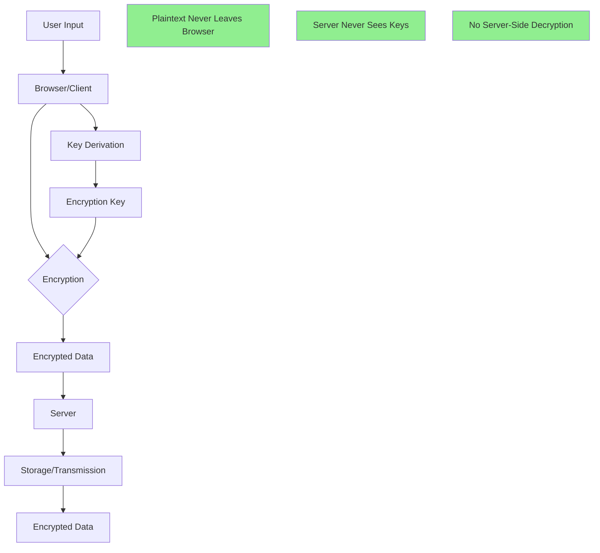
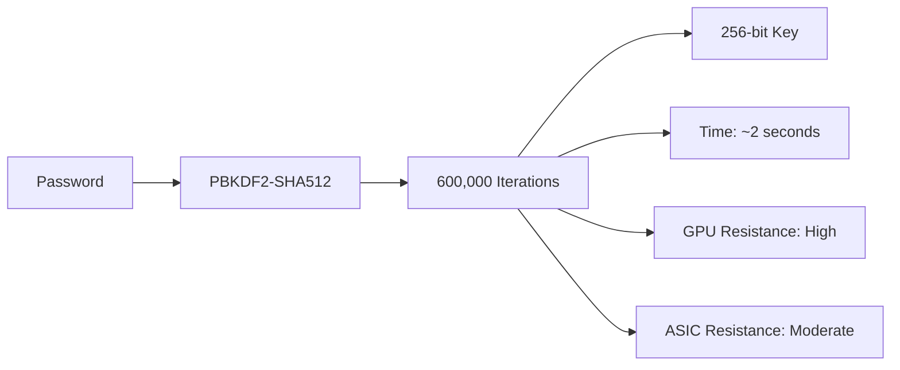
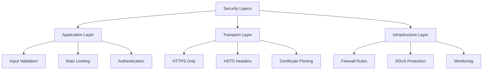
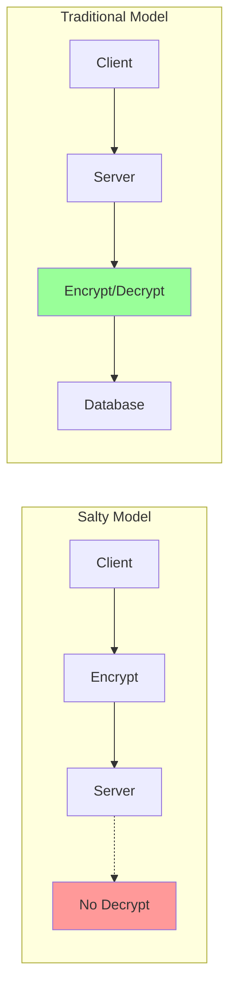

# Security architecture

## Overview

Salty implements a zero-knowledge security architecture where the server never has access to 
plaintext passwords, keys, or sensitive data. This document explains the security design 
decisions, threat model, and implementation details.

## Context

### The state of password security

In today's digital landscape, password security faces constant challenges. Data breaches expose 
millions of credentials annually, and traditional password managers require trusting a third 
party with your most sensitive data. Salty addresses these concerns through a fundamentally 
different approach: zero-knowledge architecture.

### Why zero-knowledge matters

Zero-knowledge systems ensure that service providers can't access user data, even if they wanted 
to. This approach protects users from insider threats, server compromises, and legal compulsion. 
By performing all cryptographic operations client-side, Salty eliminates entire categories of 
vulnerabilities.

## Background

Traditional password managers and encryption tools often require trusting a server with 
sensitive data. Even when encryption is used, servers typically handle key management, creating 
potential vulnerabilities. Salty takes a different approach by performing all cryptographic 
operations client-side, ensuring the server remains completely untrusted.

## How zero-knowledge architecture works



### Client-side encryption flow

1. **User provides input**: Master password and site identifier
2. **Browser derives key**: PBKDF2-SHA512 with 600,000 iterations
3. **Browser encrypts**: AES-GCM-256 encryption happens locally
4. **Only ciphertext sent**: Server receives only encrypted data
5. **No decryption capability**: Server cannot decrypt without user's key

### Key security properties

- **Forward secrecy**: Past communications remain secure even if long-term keys are compromised.
- **Perfect forward secrecy**: Each encryption operation uses a unique IV.
- **Authenticated encryption**: AES-GCM provides both confidentiality and integrity.
- **No key escrow**: No master keys or backdoors exist.

## Discussion

### Philosophical approach to security

Salty's design philosophy centers on the principle that security systems should protect users 
even from the service providers themselves. This approach influences every architectural decision, 
from the choice of cryptographic algorithms to the implementation of the user interface.

### Trade-offs and considerations

Every security system involves trade-offs. Salty prioritizes security and privacy over 
convenience features like password recovery. This design choice means users must take 
responsibility for remembering their master passwords, but it also means their data remains 
secure even in worst-case scenarios.

### Evolution of the architecture

The zero-knowledge architecture has evolved through careful consideration of threat models and 
user needs. Early versions considered server-side key derivation for performance, but this was 
rejected in favor of complete client-side operations. Similarly, the choice of 600,000 PBKDF2 
iterations represents a careful balance between security and usability, adjusted over time as 
computing power has increased.

## Design decisions

### Why client-side encryption?

**Advantages**:
- Zero-knowledge proof: Server compromise doesn't expose user data.
- No trust required: Users don't need to trust the server operator.
- Regulatory compliance: No sensitive data stored or processed server-side.
- Simplified security: Smaller attack surface.

**Trade-offs**:
- Performance: CPU-intensive operations in browser.
- Recovery: No password reset possible (by design).
- Browser security: Depends on browser's JavaScript engine security.

### Why PBKDF2-SHA512 with 600,000 iterations?

The iteration count balances security and usability:



**Security analysis**:
- **2 seconds** on modern CPU prevents rapid brute force.
- **600,000 iterations** exceeds OWASP 2023 recommendation (310,000).
- **SHA512** provides better GPU resistance than SHA256.
- Future-proofed for increasing computational power.

### Why AES-GCM-256?

**Chosen for**:
- Industry standard symmetric encryption.
- Hardware acceleration in modern browsers.
- Authenticated encryption (AEAD).
- NIST approved for TOP SECRET data.

**Implementation details**:
- 256-bit key size (derived from PBKDF2).
- 96-bit (12-byte) random IV per operation.
- 128-bit authentication tag.
- No padding oracle vulnerabilities.

### Why basE91 encoding?

Traditional base64 wastes space. basE91 provides:
- **13% more efficient** than base64.
- Safe for URLs and databases.
- Human-readable output.
- No padding characters.

## Common security patterns

### Defense in depth



Each layer provides independent security:

1. **Application**: Input validation, rate limiting, secure headers
2. **Transport**: TLS 1.3, HSTS, certificate validation
3. **Infrastructure**: Network isolation, access controls, monitoring

### Principle of least privilege

The server has minimal capabilities:
- Can't decrypt user data.
- Can't derive user passwords.
- Can't modify encrypted payloads.
- Only serves static files and routes requests.

### Fail-safe defaults

All operations default to secure behavior:
- Decryption failures return null, not error details.
- Invalid input rejected early with generic errors.
- Rate limiting active by default.
- Security headers always applied.

## Comparison with alternatives

### Traditional password managers

| Feature | Salty | Traditional |
|---------|-------|-------------|
| Server knows password | ❌ Never | ✅ Usually |
| Password recovery | ❌ Impossible | ✅ Possible |
| Server compromise impact | Minimal | Catastrophic |
| Trust required | None | High |
| Offline capable | ✅ Yes | ⚠️ Limited |

### Other encryption tools

| Approach | Pros | Cons | Best For |
|----------|------|------|----------|
| **Salty** | Zero-knowledge, straightforward | No recovery options | Privacy-focused users |
| **PGP/GPG** | Established, flexible | Complex key management | Technical users |
| **Age** | Modern, straightforward | Limited ecosystem | File encryption |
| **Keybase** | Social proof | Requires account | Identity verification |

### Security model comparison



## Threat model analysis

### In-scope threats

1. **Server compromise**
   - Attacker gains full server access.
   - **Mitigation**: Zero-knowledge architecture, no plaintext available.

2. **Network eavesdropping**
   - Attacker intercepts communications.
   - **Mitigation**: HTTPS only, HSTS, encrypted payloads.

3. **Brute force attacks**
   - Attacker attempts to guess passwords.
   - **Mitigation**: 600k PBKDF2 iterations, rate limiting.

4. **Cross-site scripting (XSS)**
   - Attacker injects malicious scripts.
   - **Mitigation**: Strict CSP, input validation, output encoding.

5. **API abuse**
   - Attacker overwhelms system.
   - **Mitigation**: Rate limiting, authentication, monitoring.

### Out-of-scope threats

1. **Compromised client device**
   - If attacker controls user's device, all bets are off.
   - Users must secure their own devices.

2. **Weak master passwords**
   - System can't prevent users choosing "password123".
   - Education and password strength indicator provided.

3. **Browser vulnerabilities**
   - Zero-days in browser could expose operations.
   - Keep browsers updated.

4. **Physical access**
   - Attacker with physical access to unlocked device.
   - Use device lock screens.

## Implementation details

### Cryptographic pipeline

```typescript
// Simplified encryption flow
async function encrypt(message: string, password: string): Promise<string> {
  // 1. Derive key from password
  const salt = hexToBytes(SALT_HEX);
  const keyMaterial = await pbkdf2(password, salt, 600000);
  
  // 2. Generate random IV
  const iv = crypto.getRandomValues(new Uint8Array(12));
  
  // 3. Import key for AES-GCM
  const key = await crypto.subtle.importKey(
    'raw', keyMaterial, { name: 'AES-GCM' }, false, ['encrypt']
  );
  
  // 4. Encrypt with authentication
  const encrypted = await crypto.subtle.encrypt(
    { name: 'AES-GCM', iv }, key, textEncoder.encode(message)
  );
  
  // 5. Combine IV + ciphertext + tag
  const combined = new Uint8Array(iv.length + encrypted.byteLength);
  combined.set(iv);
  combined.set(new Uint8Array(encrypted), iv.length);
  
  // 6. Encode for transport
  return base91.encode(combined);
}
```

### Security Validation

Every operation includes validation:

```typescript
function validateInput(payload: string, key: string): void {
  // Size limits prevent DoS
  if (payload.length > 1048576) throw new Error('Payload too large');
  if (key.length > 1024) throw new Error('Key too large');
  
  // Character validation
  if (!isValidBase91(payload)) throw new Error('Invalid payload format');
  
  // Prevent timing attacks
  if (!constantTimeValidate(key)) throw new Error('Invalid key');
}
```

### Rate Limiting Implementation

```typescript
const rateLimiter = new Map<string, number[]>();

function checkRateLimit(ip: string): boolean {
  const now = Date.now();
  const window = 3600000; // 1 hour
  const limit = 20;
  
  // Get request timestamps
  const requests = rateLimiter.get(ip) || [];
  
  // Remove old requests
  const recent = requests.filter(time => now - time < window);
  
  // Check limit
  if (recent.length >= limit) return false;
  
  // Add current request
  recent.push(now);
  rateLimiter.set(ip, recent);
  
  return true;
}
```

## Security Monitoring

### Key Metrics

Monitor these security indicators:

1. **Authentication Failures**: Spike indicates attack
2. **Rate Limit Violations**: Track by IP and pattern
3. **Encryption Operations**: Unusual volume patterns
4. **Error Rates**: High errors may indicate probing
5. **Geographic Anomalies**: Requests from unexpected locations

### Incident Response

If security event detected:

1. **Immediate**: Rate limiting kicks in automatically
2. **Short-term**: Review logs for attack patterns
3. **Long-term**: Update security rules if needed
4. **Post-incident**: Document and improve defenses

## Future Enhancements

### Under Consideration

1. **Argon2id**: More memory-hard than PBKDF2
2. **WebAuthn**: Hardware key support
3. **Encrypted Indexes**: Searchable encryption
4. **Quantum Resistance**: Post-quantum algorithms

### Maintaining Security

Regular security maintenance:
- Update dependencies monthly
- Security audit annually  
- Penetration testing for major releases
- Monitor security advisories
- Review threat model quarterly

## Further Reading

- [Cryptographic Design](./cryptographic-design.md) - Detailed crypto implementation
- [Threat Model](./threat-model.md) - Complete threat analysis
- [Performance Considerations](./performance.md) - Security vs performance trade-offs
- [OWASP Cheat Sheets](https://cheatsheetseries.owasp.org/) - Security best practices