# Threat model

## Overview

This document provides a comprehensive analysis of Salty's threat model, identifying potential 
attackers, their capabilities, attack vectors, and our defensive measures. Understanding these 
threats helps users make informed decisions about using Salty for their security needs.

## Context

### Why threat modeling matters

Security isn't just about implementing strong cryptography—it's about understanding the complete 
picture of potential threats and designing defenses accordingly. This threat model helps both 
developers and users understand what Salty protects against and what remains outside its scope.

### Background

A threat model systematically identifies and evaluates potential security threats. For Salty, 
we consider threats against:

1. **Confidentiality**: Unauthorized access to plaintext data
2. **Integrity**: Unauthorized modification of data
3. **Availability**: Denial of service or system disruption
4. **Privacy**: Tracking or identification of users.

## Discussion

### Threat modeling methodology

This analysis uses the STRIDE methodology (Spoofing, Tampering, Repudiation, Information 
disclosure, Denial of service, Elevation of privilege) applied to Salty's architecture. We 
evaluate each threat category against our zero-knowledge design principles.

## Threat actors

### Nation-state adversaries

**Capabilities**:
- Massive computational resources.
- Zero-day exploits.
- Supply chain compromise.
- Legal compulsion.

**Likelihood**: Low for most users
**Impact**: Critical if targeted

**Defenses**:
- Strong cryptography (AES-256, 600k PBKDF2).
- Zero-knowledge architecture.
- Open source for auditing.
- No backdoors or key escrow.

### Cybercriminals

**Capabilities**:
- Commodity malware
- Social engineering
- Ransomware
- Credential stuffing

**Likelihood**: Medium
**Impact**: High

**Defenses**:
- Client-side encryption
- No stored credentials
- Rate limiting
- Security headers

### Insider Threats

**Capabilities**:
- Server access
- Code modification
- Log access
- Configuration changes

**Likelihood**: Low
**Impact**: Medium

**Defenses**:
- Zero-knowledge design
- Minimal logging
- Code signing
- Deployment verification

### Script Kiddies

**Capabilities**:
- Automated tools
- Known exploits
- DDoS attacks
- Basic scanning

**Likelihood**: High
**Impact**: Low

**Defenses**:
- Up-to-date dependencies
- Rate limiting
- Input validation
- Security headers

## Attack Vectors and Mitigations

### 1. Direct Cryptographic Attacks


#### Brute Force Attack

**Threat**: Attacker attempts to guess passwords
**Likelihood**: High attempts, Low success
**Impact**: Account compromise

**Mitigations**:
- 600,000 PBKDF2 iterations (~2 seconds per attempt)
- Rate limiting (20 requests/hour)
- Strong password recommendations
- No online brute force possible

**Residual Risk**: Weak user passwords

#### Cryptanalysis

**Threat**: Breaking AES or finding weaknesses
**Likelihood**: Very Low
**Impact**: Total compromise

**Mitigations**:
- Industry-standard AES-GCM-256
- Proper IV generation
- No custom cryptography
- Regular security updates

**Residual Risk**: Unknown vulnerabilities in AES

### 2. Network-Based Attacks

#### Man-in-the-Middle (MITM)

**Threat**: Intercepting communications
**Likelihood**: Medium on untrusted networks
**Impact**: Medium (only encrypted data visible)

**Mitigations**:
- HTTPS enforced
- HSTS headers
- Certificate pinning (optional)
- Encrypted payloads

**Residual Risk**: Compromised CA or BGP hijacking

#### DNS Hijacking

**Threat**: Redirecting users to fake site
**Likelihood**: Low
**Impact**: High (credential theft)

**Mitigations**:
- DNSSEC support
- HSTS preloading
- User education
- Browser warnings

**Residual Risk**: User ignoring warnings

### 3. Client-Side Attacks

#### Cross-Site Scripting (XSS)

**Threat**: Injecting malicious scripts
**Likelihood**: Medium attempts
**Impact**: Critical (key theft)

**Mitigations**:
```javascript
// Strict CSP policy
Content-Security-Policy: 
  default-src 'self';
  script-src 'self' 'unsafe-inline';
  object-src 'none';
  base-uri 'self';
```

- Input sanitization
- Output encoding
- DOM manipulation safety

**Residual Risk**: CSP bypass techniques

#### Malicious Browser Extensions

**Threat**: Extensions reading page content
**Likelihood**: Medium
**Impact**: Critical

**Mitigations**:
- WebCrypto API (keys not accessible)
- User education
- Extension permissions review
- Isolated crypto operations

**Residual Risk**: User installing malicious extensions

### 4. Server-Side Attacks

#### Server Compromise

**Threat**: Attacker gains server access
**Likelihood**: Low
**Impact**: Low (zero-knowledge)

```mermaid
graph TD
    A[Server Compromise] --> B[What Attacker Gets]
    B --> C[Encrypted payloads]
    B --> D[Source code]
    B --> E[Configuration]
    B --> F[Logs]
    
    C --> G[❌ Cannot decrypt]
    D --> H[✅ Already open source]
    E --> I[⚠️ Salt value]
    F --> J[❌ No sensitive data]
    
    style G fill:#90EE90
    style H fill:#90EE90
    style J fill:#90EE90
    style I fill:#ffff99
```



**Mitigations**:
- Zero-knowledge architecture
- Minimal server functionality
- No sensitive data storage
- Regular security updates

**Residual Risk**: Service disruption

#### API Abuse

**Threat**: Overwhelming API endpoints
**Likelihood**: High
**Impact**: Low

**Mitigations**:
- Rate limiting (20/hour per IP)
- API authentication
- Request size limits
- Resource monitoring

**Residual Risk**: Distributed attacks

### 5. Social Engineering

#### Phishing

**Threat**: Fake Salty sites
**Likelihood**: Medium
**Impact**: High

**Mitigations**:
- Clear branding
- Certificate transparency
- User education
- Bookmark encouragement

**Residual Risk**: Convincing phishing sites

#### Password Reset Scams

**Threat**: Tricking users about password recovery
**Likelihood**: Low
**Impact**: Medium

**Mitigations**:
- Clear communication: No password recovery
- User education
- No email collection
- Warning messages

**Residual Risk**: User confusion

## Attack Trees

### Complete System Compromise

```mermaid
graph TD
    A[Compromise Salty] --> B[Break Cryptography]
    A --> C[Compromise Client]
    A --> D[Compromise Server]
    A --> E[Social Engineering]
    
    B --> B1[Break AES ❌]
    B --> B2[Break PBKDF2 ❌]
    B --> B3[Find Implementation Flaw ⚠️]
    
    C --> C1[XSS Attack ⚠️]
    C --> C2[Browser Exploit ⚠️]
    C --> C3[Malware ✅]
    
    D --> D1[Root Access ⚠️]
    D --> D2[Code Injection ❌]
    D --> D3[Database Access ❌]
    
    E --> E1[Phishing ✅]
    E --> E2[Credential Theft ✅]
    
    style B1 fill:#ff9999
    style B2 fill:#ff9999
    style D2 fill:#ff9999
    style D3 fill:#ff9999
    style B3 fill:#ffff99
    style C1 fill:#ffff99
    style C2 fill:#ffff99
    style D1 fill:#ffff99
    style C3 fill:#90EE90
    style E1 fill:#90EE90
    style E2 fill:#90EE90
```



Legend:
- 🔴 ❌ Very difficult/impossible
- 🟡 ⚠️ Possible but mitigated
- 🟢 ✅ Feasible attack vector

## Security Assumptions

### What We Assume

1. **Modern browser security**: WebCrypto API is secure
2. **TLS is effective**: HTTPS provides confidentiality
3. **User device security**: No malware on user's device
4. **Cryptographic algorithms**: AES and SHA-512 remain secure
5. **Entropy sources**: Browser CSPRNG is truly random

### What We Don't Assume

1. **Server trustworthiness**: Server could be compromised
2. **Network security**: Network could be hostile
3. **User passwords**: Users might choose weak passwords
4. **Extension safety**: Browser extensions could be malicious
5. **Physical security**: Device could be accessed

## Risk Matrix

| Threat | Likelihood | Impact | Risk Level | Mitigation Status |
|--------|------------|--------|------------|-------------------|
| Weak passwords | High | High | High | ⚠️ Partial |
| Phishing | Medium | High | High | ⚠️ Partial |
| XSS | Medium | Critical | High | ✅ Strong |
| Server compromise | Low | Low | Low | ✅ Strong |
| Cryptographic break | Very Low | Critical | Medium | ✅ Strong |
| DDoS | High | Low | Medium | ✅ Strong |
| MITM | Medium | Medium | Medium | ✅ Strong |
| Supply chain | Low | Critical | Medium | ⚠️ Partial |

## Defense in Depth

### Layer 1: Cryptographic

- Strong algorithms (AES-256, PBKDF2-SHA512)
- Proper implementation (WebCrypto API)
- Secure randomness (crypto.getRandomValues)
- No weak modes or parameters

### Layer 2: Application

- Input validation
- Output encoding  
- Security headers
- Rate limiting
- Error handling

### Layer 3: Network

- HTTPS only
- HSTS enforcement
- Certificate validation
- No HTTP fallback

### Layer 4: Architecture

- Zero-knowledge design
- Client-side encryption
- Stateless operation
- Minimal attack surface

## Incident Response

### If Compromise Suspected

1. **Immediate Actions**:
   - Rotate SALT_HEX value
   - Reset all derived passwords
   - Review access logs
   - Check code integrity

2. **Investigation**:
   - Analyze logs for anomalies
   - Check for code modifications
   - Review dependency changes
   - Monitor for data exfiltration

3. **Communication**:
   - Notify affected users
   - Publish security advisory
   - Update documentation
   - Provide mitigation steps

### Security Contacts

- GitHub Security Advisories
- security@esolia.com
- Public disclosure after 90 days

## Continuous Improvement

### Regular Reviews

- Quarterly threat model updates
- Annual penetration testing
- Continuous dependency scanning
- Community security audits

### Metrics Tracked

- Failed authentication attempts
- Rate limit violations
- Error rates by type
- Geographic anomalies
- Performance degradation

## Conclusion

Salty's threat model demonstrates strong resistance to most attack vectors through:

1. **Zero-knowledge architecture**: Server compromise has minimal impact
2. **Strong cryptography**: Resistant to brute force and cryptanalysis  
3. **Defense in depth**: Multiple security layers
4. **Transparency**: Open source for verification

The primary residual risks are:
- Weak user passwords
- Phishing attacks
- Client-side malware

Users should understand these risks and take appropriate precautions.

## Further Reading

- [Security Architecture](./security-architecture.md) - Detailed security design
- [Cryptographic Design](./cryptographic-design.md) - Cryptographic implementation
- [How to Configure Security Settings](../how-to/configure-security.md) - Hardening guide
- [OWASP Threat Modeling](https://owasp.org/www-community/Threat_Modeling) - Methodology reference