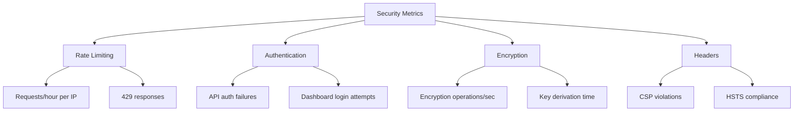

# How to Configure Security Settings

This guide shows you how to configure Salty's security settings for optimal protection. Use these configurations to harden your deployment and meet compliance requirements.

## Before you begin

Ensure you have:
- Administrative access to your Salty deployment
- Understanding of your security requirements
- Access to modify environment variables
- SSL/TLS certificates (for production)

## Solution

### Option 1: Basic Security Configuration

Use this approach for standard deployments with moderate security requirements.

1. Set required environment variables:
   ```bash
   # Generate a secure salt (required)
   export SALT_HEX=$(openssl rand -hex 16)
   
   # Set production environment
   export NODE_ENV=production
   
   # Configure logging
   export LOG_LEVEL=INFO
   export LOG_FORMAT=json
   ```

2. Verify the configuration:
   ```bash
   deno task start
   ```

3. Check security headers:
   ```bash
   curl -I https://your-salty-instance.com
   ```

### Option 2: Enhanced Security Configuration

Use this approach for high-security environments or compliance requirements.

1. Configure comprehensive security settings:
   ```bash
   # Strong cryptographic salt
   export SALT_HEX=$(openssl rand -hex 16)
   
   # API authentication
   export API_KEY=$(openssl rand -base64 32)
   
   # Restricted logging
   export LOG_LEVEL=SECURITY
   export LOG_FORMAT=json
   
   # Alert webhook for security events
   export WEBHOOK_URL=https://security-team.example.com/alerts
   
   # Admin dashboard protection
   export DASH_USER=admin
   export DASH_PASS=$(openssl rand -base64 24)
   ```

2. Configure rate limiting (built-in at 20 requests/hour):
   ```typescript
   // Rate limiting is automatically enforced
   // Customize in server.ts if needed:
   const RATE_LIMIT = {
     windowMs: 60 * 60 * 1000, // 1 hour
     max: 20, // requests per window
     message: "Too many requests"
   };
   ```

3. Set up security monitoring:
   ```bash
   # Monitor rate limit violations
   grep "Rate limit exceeded" /var/log/salty.log
   
   # Track API authentication failures
   grep "API authentication failed" /var/log/salty.log
   
   # Watch for security events
   grep "SECURITY" /var/log/salty.log
   ```

### Option 3: Compliance-Focused Configuration

Use this approach for regulated environments (HIPAA, PCI-DSS, SOC 2).

1. Enable comprehensive audit logging:
   ```bash
   # Maximum logging detail
   export LOG_LEVEL=DEBUG
   export LOG_FORMAT=json
   
   # Webhook for audit trail
   export WEBHOOK_URL=https://siem.example.com/salty
   
   # Strict environment
   export NODE_ENV=production
   ```

2. Configure security headers via reverse proxy:
   ```nginx
   # nginx.conf
   add_header Strict-Transport-Security "max-age=31536000; includeSubDomains; preload" always;
   add_header Content-Security-Policy "default-src 'self'; script-src 'self' 'unsafe-inline'; style-src 'self' 'unsafe-inline' https://fonts.googleapis.com; font-src 'self' https://fonts.gstatic.com; img-src 'self' data:; connect-src 'self'; frame-ancestors 'none'; base-uri 'self'; form-action 'self'" always;
   add_header X-Content-Type-Options "nosniff" always;
   add_header X-Frame-Options "DENY" always;
   add_header X-XSS-Protection "1; mode=block" always;
   add_header Referrer-Policy "strict-origin-when-cross-origin" always;
   add_header Permissions-Policy "geolocation=(), microphone=(), camera=()" always;
   ```

3. Implement access controls:
   ```bash
   # Restrict file permissions
   chmod 600 .env
   chmod 755 server.ts
   
   # Run as non-root user
   useradd -r -s /bin/false salty
   chown -R salty:salty /opt/salty
   ```

## Verify your configuration

### Security Checklist

Run through this checklist after configuration:

```bash
# 1. Check environment variables
env | grep -E "(SALT_HEX|API_KEY|LOG_LEVEL)"

# 2. Verify HTTPS only
curl http://your-instance.com  # Should redirect to HTTPS

# 3. Test security headers
curl -I https://your-instance.com | grep -i "security\|frame\|content-type"

# 4. Verify rate limiting
for i in {1..25}; do curl https://your-instance.com/health; done
# Should see rate limit message after 20 requests

# 5. Check API authentication (if enabled)
curl https://your-instance.com/api/encrypt  # Should fail without key
curl -H "X-API-Key: wrong-key" https://your-instance.com/api/encrypt  # Should fail

# 6. Review logs for sensitive data
tail -n 100 /var/log/salty.log | grep -i "password\|key\|secret"
# Should find NO sensitive data
```

### Security Metrics Dashboard

Monitor these key metrics:



## Troubleshooting

**Problem**: API authentication not working
**Solution**: Ensure API_KEY is base64 encoded and X-API-Key header is sent

**Problem**: Rate limiting too restrictive
**Solution**: Modify rate limit in server.ts and rebuild

**Problem**: Logs contain sensitive data
**Solution**: Set LOG_LEVEL to INFO or higher, never DEBUG in production

**Problem**: Security headers not appearing
**Solution**: Check reverse proxy configuration, headers may be overridden

## Security hardening tips

### Network Security
- Use firewall rules to restrict access
- Enable DDoS protection at network edge
- Implement geographic restrictions if applicable
- Use VPN for administrative access

### Application Security
- Regularly update Deno runtime
- Monitor security advisories
- Implement intrusion detection
- Enable comprehensive logging
- Regular security audits

### Operational Security
- Rotate SALT_HEX periodically (requires coordination)
- Update API_KEY quarterly
- Review access logs weekly
- Conduct penetration testing
- Document security procedures

## Compliance configurations

### HIPAA Compliance
```bash
export LOG_LEVEL=INFO
export LOG_FORMAT=json
export WEBHOOK_URL=https://siem.healthcare.org/hipaa
# Enable encryption at rest for logs
# Implement 90-day log retention
# Configure automatic session timeout
```

### PCI-DSS Compliance
```bash
export NODE_ENV=production
export LOG_LEVEL=SECURITY
# Implement network segmentation
# Enable file integrity monitoring
# Configure vulnerability scanning
```

### SOC 2 Compliance
```bash
export LOG_LEVEL=INFO
export WEBHOOK_URL=https://audit.company.com/soc2
# Implement change management
# Document access controls
# Regular security training
```

## Related tasks

- [How to Set Up API Authentication](./setup-api-auth.md)
- [How to Monitor with OpenTelemetry](./monitor-telemetry.md)
- [How to Generate Secure Passwords](./generate-passwords.md)
- [How to Share Encrypted Payloads](./share-payloads.md)