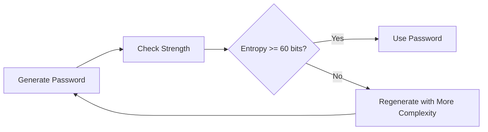

# How to Generate Secure Passwords

This guide shows you how to generate secure passwords using Salty. Use these approaches when you need deterministic passwords (same input = same output) or truly random passwords.

## Before you begin

Ensure you have:
- Access to a Salty instance (local or hosted)
- Understanding of the difference between derived and random passwords
- A secure place to store your master password (if using derivation)

## Solution

### Option 1: Deterministic Password Derivation

Use this approach when you want to regenerate the same password from a master password and site identifier.

1. Navigate to the main Salty interface

2. Enter your master password in the **Key** field:
   ```
   my-super-secret-master-password-2024
   ```

3. Enter a unique identifier in the **Salt** field:
   ```
   github.com:myusername
   ```

4. Click **Salty!** to generate the password

5. The derived password appears in the result field:
   ```
   Example output: K9#mP2$vN8@rL5^qT1&wX3!zY7*
   ```

#### Best Practices for Derivation

- **Use unique salts**: Combine site + username for uniqueness
  ```
  Good: amazon.com:john.doe
  Good: github.com:work-account
  Bad:  amazon (too generic)
  ```

- **Create a salt pattern**: Be consistent to remember easily
  ```
  Pattern: [domain]:[username]:[year]
  Example: gitlab.com:jsmith:2024
  ```

- **Handle password rotations**: Add version numbers
  ```
  v1: facebook.com:email@example.com:v1
  v2: facebook.com:email@example.com:v2
  ```

### Option 2: Random Password Generation

Use this approach when you need a completely random password and will store it in a password manager.

1. Scroll to the **Password Generator** section

2. Configure password requirements:
   
   **For maximum security (password managers):**
   ```
   Length: 32
   ✓ Include uppercase (A-Z)
   ✓ Include lowercase (a-z)
   ✓ Include numbers (0-9)
   ✓ Include symbols (!@#$%^&*)
   ```

   **For sites with restrictions:**
   ```
   Length: 16
   ✓ Include uppercase
   ✓ Include lowercase
   ✓ Include numbers
   ✗ Include symbols (if not allowed)
   ```

3. Click **Generate** to create the password

4. Copy the generated password immediately

### Option 3: Memorable Random Passwords

For passwords you need to type manually:

1. Generate with balanced settings:
   ```
   Length: 20
   ✓ Include uppercase
   ✓ Include lowercase
   ✓ Include numbers
   ✗ Include symbols (easier to type)
   ```

2. Generate multiple times until you find one that's relatively memorable

3. Practice typing it a few times before saving

## Verify your password strength

Always check the strength of generated passwords:

1. Copy your generated password
2. Paste into the **Password Strength Checker**
3. Verify the strength indicators:
   - **Entropy**: Should be 60+ bits for sensitive accounts
   - **Time to crack**: Should show years/centuries for online attacks
   - **Character variety**: Should use multiple character types



## Common password requirements

### Financial Services
```
Length: 16-20 characters
✓ Uppercase, lowercase, numbers
✓ At least one symbol
✗ No repeated characters
✗ No dictionary words
```

### Government Services
```
Length: 12-16 characters
✓ Uppercase, lowercase, numbers
✓ Special characters from limited set: !@#$%
✗ No spaces
✗ No username portions
```

### Corporate Systems
```
Length: 8+ characters (prefer 14+)
✓ Three of four: uppercase, lowercase, numbers, symbols
✗ No previous 10 passwords
✗ Must change every 90 days
```

## Troubleshooting

**Problem**: Generated password is rejected by website
**Solution**: Check site's specific requirements and adjust generator settings

**Problem**: Can't remember derived password salt
**Solution**: Use a consistent pattern and document it securely (not with passwords)

**Problem**: Need to share password with team
**Solution**: Use Salty's encryption feature instead of sharing the plain password

**Problem**: Password too complex for manual entry
**Solution**: Reduce length slightly or disable symbols for easier typing

## Security tips

1. **Never reuse passwords**: Each service should have a unique password
2. **Store securely**: Use a password manager for random passwords
3. **Master password safety**: Never write down or share your derivation key
4. **Regular updates**: Rotate passwords for critical accounts periodically
5. **Avoid patterns**: Don't use keyboard patterns (qwerty, 123456)

## Related tasks

- [How to Share Encrypted Payloads](./share-payloads.md)
- [How to Configure Security Settings](./configure-security.md)
- [How to Set Up API Authentication](./setup-api-auth.md)