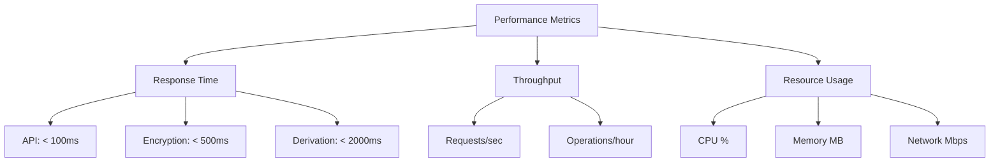

# How to Monitor with OpenTelemetry

This guide shows you how to monitor Salty's performance and security events using the built-in telemetry system. Use this to track performance metrics, identify bottlenecks, and maintain security visibility.

## Before you begin

Ensure you have:
- Access to Salty logs and metrics
- Understanding of basic monitoring concepts
- A log aggregation system (optional)
- Webhook endpoint for alerts (optional)

## Solution

### Option 1: Basic Monitoring with Logs

Use this approach for simple deployments with standard monitoring needs.

1. Configure logging levels:
   ```bash
   # Set appropriate log level
   export LOG_LEVEL=INFO
   export LOG_FORMAT=json
   ```

2. Monitor key events:
   ```bash
   # Watch real-time logs
   deno task start 2>&1 | tee salty.log
   
   # Filter for specific events
   tail -f salty.log | grep -E "(SECURITY|ERROR|CRITICAL)"
   ```

3. Parse structured logs:
   ```bash
   # Extract performance metrics
   cat salty.log | jq 'select(.category == "telemetry") | {timestamp, duration, operation}'
   
   # Find slow operations (>1000ms)
   cat salty.log | jq 'select(.duration > 1000)'
   ```

### Option 2: Advanced Telemetry Tracking

Use this approach for performance optimization and detailed analytics.

1. Enable detailed telemetry:
   ```bash
   # Maximum telemetry detail
   export LOG_LEVEL=DEBUG
   export LOG_FORMAT=json
   ```

2. Track operation performance:
   ```javascript
   // Telemetry automatically tracks:
   // - HTTP request duration
   // - Encryption/decryption time
   // - Key derivation performance
   // - Database query time (if applicable)
   ```

3. Create performance dashboard:
   ```bash
   # Extract telemetry data
   cat salty.log | jq 'select(.category == "telemetry")' > telemetry.json
   
   # Calculate average response times
   cat telemetry.json | jq -s 'map(.duration) | add/length'
   
   # Find 95th percentile
   cat telemetry.json | jq -s 'map(.duration) | sort | .[length * 0.95 | floor]'
   ```

### Option 3: Security Event Monitoring

Use this approach for compliance and security operations.

1. Configure security alerting:
   ```bash
   # Set security-focused logging
   export LOG_LEVEL=SECURITY
   export WEBHOOK_URL=https://security-alerts.example.com/webhook
   ```

2. Monitor security events:
   ```bash
   # Track authentication failures
   grep "API authentication failed" salty.log | wc -l
   
   # Monitor rate limiting
   grep "Rate limit exceeded" salty.log | awk '{print $NF}' | sort | uniq -c
   
   # Detect potential attacks
   grep -E "(SECURITY|CRITICAL)" salty.log | tail -20
   ```

3. Set up automated alerts:
   ```python
   # alert-monitor.py
   import json
   import requests
   from datetime import datetime, timedelta
   
   def check_security_events(log_file, webhook_url):
       critical_events = []
       
       with open(log_file, 'r') as f:
           for line in f:
               try:
                   event = json.loads(line)
                   if event.get('level') in ['SECURITY', 'CRITICAL']:
                       critical_events.append(event)
               except:
                   continue
       
       if critical_events:
           alert = {
               'title': 'Salty Security Alert',
               'events': critical_events[-10:],  # Last 10 events
               'count': len(critical_events),
               'timestamp': datetime.now().isoformat()
           }
           requests.post(webhook_url, json=alert)
   
   # Run periodically
   check_security_events('salty.log', 'https://alerts.example.com/webhook')
   ```

## Verify your monitoring

### Health Check Monitoring

Monitor the health endpoint for system status:

```bash
# Basic health check
curl https://salty.example.com/health

# Parse health metrics
curl -s https://salty.example.com/health | jq '{
  status,
  uptime_hours: (.uptime / 3600 | floor),
  memory_mb: (.memory.heapUsed / 1048576 | floor)
}'

# Continuous monitoring
while true; do
  curl -s https://salty.example.com/health | jq -r '.status'
  sleep 60
done
```

### Performance Baselines

Establish normal performance metrics:



## Monitoring dashboards

### Grafana Configuration

Create a Grafana dashboard for Salty metrics:

```json
{
  "dashboard": {
    "title": "Salty Monitoring",
    "panels": [
      {
        "title": "Request Rate",
        "targets": [{
          "expr": "rate(salty_requests_total[5m])"
        }]
      },
      {
        "title": "Response Time",
        "targets": [{
          "expr": "histogram_quantile(0.95, salty_request_duration_seconds)"
        }]
      },
      {
        "title": "Error Rate",
        "targets": [{
          "expr": "rate(salty_errors_total[5m])"
        }]
      },
      {
        "title": "Security Events",
        "targets": [{
          "expr": "increase(salty_security_events_total[1h])"
        }]
      }
    ]
  }
}
```

### Log Aggregation Setup

Configure log shipping to centralized system:

```yaml
# filebeat.yml
filebeat.inputs:
- type: log
  enabled: true
  paths:
    - /var/log/salty/*.log
  json.keys_under_root: true
  json.add_error_key: true
  fields:
    service: salty
    environment: production

output.elasticsearch:
  hosts: ["elasticsearch:9200"]
  index: "salty-%{+yyyy.MM.dd}"
```

## Troubleshooting

**Problem**: Missing telemetry data
**Solution**: Ensure LOG_LEVEL includes telemetry events (INFO or DEBUG)

**Problem**: Webhook alerts not firing
**Solution**: Verify WEBHOOK_URL is accessible and returns 2xx status

**Problem**: High memory usage in logs
**Solution**: Rotate logs regularly; consider streaming to external system

**Problem**: Performance degradation over time
**Solution**: Check for memory leaks; monitor heap usage trends

## Key metrics to monitor

### Performance Metrics
- **Response Time**: 95th percentile < 1 second
- **Throughput**: Requests per second
- **Error Rate**: < 0.1% of requests
- **CPU Usage**: < 80% sustained
- **Memory Usage**: Stable over time

### Security Metrics
- **Authentication Failures**: Sudden spikes indicate attacks
- **Rate Limit Hits**: Track by IP address
- **Encryption Operations**: Volume and performance
- **API Usage**: Patterns by endpoint and client

### Business Metrics
- **Active Users**: Unique IPs per hour
- **Operation Types**: Encrypt vs decrypt vs derive
- **Geographic Distribution**: Request origins
- **Peak Usage Times**: Capacity planning

## Alert configuration

### Critical Alerts
```javascript
// Critical conditions requiring immediate attention
const criticalAlerts = [
  {
    name: "High Error Rate",
    condition: "error_rate > 5%",
    threshold: "5 minutes",
    action: "Page on-call engineer"
  },
  {
    name: "Security Breach Attempt",
    condition: "auth_failures > 100",
    threshold: "10 minutes",
    action: "Alert security team"
  },
  {
    name: "Service Down",
    condition: "health_check_failed",
    threshold: "2 consecutive failures",
    action: "Restart service, page if persists"
  }
];
```

### Warning Alerts
```javascript
// Warning conditions for proactive response
const warningAlerts = [
  {
    name: "Elevated Response Time",
    condition: "p95_response_time > 2s",
    threshold: "15 minutes",
    action: "Notify operations team"
  },
  {
    name: "High Memory Usage",
    condition: "memory_usage > 80%",
    threshold: "30 minutes",
    action: "Schedule investigation"
  },
  {
    name: "Unusual Traffic Pattern",
    condition: "request_rate > 3x baseline",
    threshold: "5 minutes",
    action: "Review for potential DDoS"
  }
];
```

## Integration examples

### Prometheus Exporter

```typescript
// prometheus-exporter.ts
import { serve } from "https://deno.land/std/http/server.ts";

const metrics = {
  requests_total: 0,
  errors_total: 0,
  duration_seconds: [],
};

// Parse Salty logs and update metrics
async function updateMetrics() {
  // Implementation to read logs and update metrics
}

// Expose metrics endpoint
serve((req) => {
  if (new URL(req.url).pathname === "/metrics") {
    return new Response(formatPrometheusMetrics(metrics));
  }
  return new Response("Not Found", { status: 404 });
}, { port: 9090 });
```

### CloudWatch Integration

```bash
#!/bin/bash
# Send metrics to AWS CloudWatch

# Extract metrics from logs
RESPONSE_TIME=$(cat salty.log | jq -s 'map(select(.category == "telemetry") | .duration) | add/length')
ERROR_COUNT=$(grep ERROR salty.log | wc -l)

# Send to CloudWatch
aws cloudwatch put-metric-data \
  --namespace "Salty" \
  --metric-name "ResponseTime" \
  --value "$RESPONSE_TIME" \
  --unit Milliseconds

aws cloudwatch put-metric-data \
  --namespace "Salty" \
  --metric-name "ErrorCount" \
  --value "$ERROR_COUNT" \
  --unit Count
```

## Related tasks

- [How to Configure Security Settings](./configure-security.md)
- [How to Set Up API Authentication](./setup-api-auth.md)
- [How to Share Encrypted Payloads](./share-payloads.md)
- [How to Generate Secure Passwords](./generate-passwords.md)