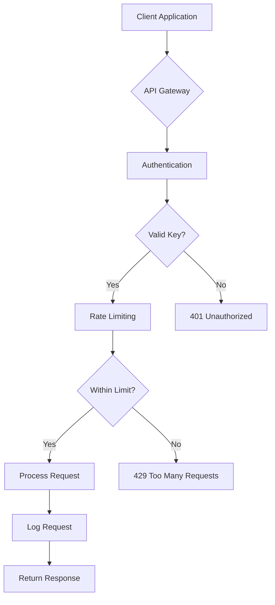

# How to Set Up API Authentication

This guide shows you how to configure API authentication for Salty's programmatic endpoints. Use this when you need to integrate Salty with other systems or automate encryption operations.

## Before you begin

Ensure you have:
- Administrative access to your Salty deployment
- Ability to set environment variables
- Understanding of API authentication concepts
- A secure method to store and distribute API keys

## Solution

### Option 1: Basic API Authentication

Use this approach for simple integrations with trusted systems.

1. Generate a secure API key:
   ```bash
   # Generate a random base64-encoded key
   export API_KEY=$(openssl rand -base64 32)
   
   # Save it securely
   echo "API_KEY=$API_KEY" >> .env
   ```

2. Restart Salty with the new configuration:
   ```bash
   # Load environment and start
   source .env
   deno task start
   ```

3. Test authentication:
   ```bash
   # Without API key (should fail)
   curl -X POST https://salty.example.com/api/encrypt \
     -H "Content-Type: application/json" \
     -d '{"message": "test", "key": "test-key"}'
   
   # With API key (should succeed)
   curl -X POST https://salty.example.com/api/encrypt \
     -H "Content-Type: application/json" \
     -H "X-API-Key: $API_KEY" \
     -d '{"message": "test", "key": "test-key"}'
   ```

### Option 2: Multi-Environment Authentication

Use this approach when you have different API keys for different environments or clients.

1. Generate environment-specific keys:
   ```bash
   # Development
   DEV_API_KEY=$(openssl rand -base64 32)
   
   # Staging
   STAGE_API_KEY=$(openssl rand -base64 32)
   
   # Production
   PROD_API_KEY=$(openssl rand -base64 32)
   ```

2. Configure based on environment:
   ```bash
   # For production deployment
   export NODE_ENV=production
   export API_KEY=$PROD_API_KEY
   ```

3. Document keys securely:
   ```yaml
   # api-keys.yaml (store in password manager)
   environments:
     development:
       key: "base64-encoded-dev-key-here"
       endpoint: "http://localhost:8000"
     staging:
       key: "base64-encoded-stage-key-here"
       endpoint: "https://staging-salty.example.com"
     production:
       key: "base64-encoded-prod-key-here"
       endpoint: "https://salty.example.com"
   ```

### Option 3: Client-Specific Authentication

Use this approach when multiple clients need different access levels or audit trails.

1. Generate unique keys per client:
   ```bash
   # Generate keys for different clients
   CLIENT_A_KEY=$(openssl rand -base64 32)
   CLIENT_B_KEY=$(openssl rand -base64 32)
   SERVICE_X_KEY=$(openssl rand -base64 32)
   ```

2. Implement key rotation schedule:
   ```bash
   # Quarterly key rotation script
   #!/bin/bash
   OLD_KEY=$API_KEY
   NEW_KEY=$(openssl rand -base64 32)
   
   # Update configuration
   sed -i "s/API_KEY=$OLD_KEY/API_KEY=$NEW_KEY/" .env
   
   # Notify clients (implement your notification method)
   echo "New API key generated: $NEW_KEY"
   ```

## Verify your configuration

### Test API Endpoints

Test each authenticated endpoint:

```bash
# Test encryption endpoint
curl -X POST https://salty.example.com/api/encrypt \
  -H "Content-Type: application/json" \
  -H "X-API-Key: $API_KEY" \
  -d '{
    "message": "Secret data to encrypt",
    "key": "encryption-password-123"
  }'

# Test decryption endpoint
curl -X POST https://salty.example.com/api/decrypt \
  -H "Content-Type: application/json" \
  -H "X-API-Key: $API_KEY" \
  -d '{
    "payload": "encrypted-base91-string-here",
    "key": "encryption-password-123"
  }'

# Test derive endpoint
curl -X POST https://salty.example.com/api/derive \
  -H "Content-Type: application/json" \
  -H "X-API-Key: $API_KEY" \
  -d '{
    "key": "master-password",
    "salt": "github.com:username"
  }'
```

### Monitor Authentication

Set up monitoring for API usage:

```bash
# Check authentication failures
grep "API authentication failed" /var/log/salty.log | tail -20

# Monitor API usage by endpoint
grep "API request" /var/log/salty.log | awk '{print $5}' | sort | uniq -c

# Track rate limiting on API
grep "Rate limit.*api" /var/log/salty.log
```

## API integration examples

### Python Integration

```python
import requests
import os

class SaltyClient:
    def __init__(self, base_url, api_key):
        self.base_url = base_url
        self.headers = {
            "Content-Type": "application/json",
            "X-API-Key": api_key
        }
    
    def encrypt(self, message, key):
        response = requests.post(
            f"{self.base_url}/api/encrypt",
            headers=self.headers,
            json={"message": message, "key": key}
        )
        response.raise_for_status()
        return response.json()["encrypted"]
    
    def decrypt(self, payload, key):
        response = requests.post(
            f"{self.base_url}/api/decrypt",
            headers=self.headers,
            json={"payload": payload, "key": key}
        )
        response.raise_for_status()
        return response.json()["decrypted"]

# Usage
client = SaltyClient(
    base_url="https://salty.example.com",
    api_key=os.environ["SALTY_API_KEY"]
)

# Encrypt sensitive data
encrypted = client.encrypt("API_KEY=secret123", "my-password")
print(f"Encrypted: {encrypted}")

# Decrypt it back
decrypted = client.decrypt(encrypted, "my-password")
print(f"Decrypted: {decrypted}")
```

### Node.js Integration

```javascript
const axios = require('axios');

class SaltyClient {
  constructor(baseUrl, apiKey) {
    this.client = axios.create({
      baseURL: baseUrl,
      headers: {
        'Content-Type': 'application/json',
        'X-API-Key': apiKey
      }
    });
  }

  async encrypt(message, key) {
    const response = await this.client.post('/api/encrypt', {
      message,
      key
    });
    return response.data.encrypted;
  }

  async decrypt(payload, key) {
    const response = await this.client.post('/api/decrypt', {
      payload,
      key
    });
    return response.data.decrypted;
  }

  async derive(key, salt) {
    const response = await this.client.post('/api/derive', {
      key,
      salt
    });
    return response.data.derived;
  }
}

// Usage
const client = new SaltyClient(
  'https://salty.example.com',
  process.env.SALTY_API_KEY
);

// Derive a password
const password = await client.derive('master-pass', 'github.com');
console.log('Derived password:', password);
```

### Shell Script Integration

```bash
#!/bin/bash

# Configuration
SALTY_URL="https://salty.example.com"
API_KEY="${SALTY_API_KEY}"

# Function to encrypt data
salty_encrypt() {
  local message="$1"
  local key="$2"
  
  curl -s -X POST "${SALTY_URL}/api/encrypt" \
    -H "Content-Type: application/json" \
    -H "X-API-Key: ${API_KEY}" \
    -d "{\"message\": \"${message}\", \"key\": \"${key}\"}" \
    | jq -r '.encrypted'
}

# Function to decrypt data
salty_decrypt() {
  local payload="$1"
  local key="$2"
  
  curl -s -X POST "${SALTY_URL}/api/decrypt" \
    -H "Content-Type: application/json" \
    -H "X-API-Key: ${API_KEY}" \
    -d "{\"payload\": \"${payload}\", \"key\": \"${key}\"}" \
    | jq -r '.decrypted'
}

# Usage example
SECRET="database_password=Pr0duct10n!"
PASSWORD="team-shared-key-2024"

echo "Encrypting secret..."
ENCRYPTED=$(salty_encrypt "$SECRET" "$PASSWORD")
echo "Encrypted: $ENCRYPTED"

echo "Decrypting..."
DECRYPTED=$(salty_decrypt "$ENCRYPTED" "$PASSWORD")
echo "Decrypted: $DECRYPTED"
```

## Troubleshooting

**Problem**: 401 Unauthorized errors
**Solution**: Verify API_KEY environment variable is set and matches the header

**Problem**: API key rejected despite being correct
**Solution**: Check for whitespace or encoding issues in the key

**Problem**: Rate limiting on API calls
**Solution**: Implement exponential backoff; current limit is 20 requests/hour per IP

**Problem**: Cannot rotate API keys without downtime
**Solution**: Implement support for multiple valid keys during rotation period

## Security best practices

### Key Management
- Store API keys in environment variables, never in code
- Use different keys for different environments
- Rotate keys quarterly or after any suspected compromise
- Log API key usage for audit trails

### Access Control
- Limit API access by IP address when possible
- Use HTTPS exclusively for API calls
- Monitor for unusual usage patterns
- Implement additional authentication layers for sensitive operations

### Integration Security


## Related tasks

- [How to Configure Security Settings](./configure-security.md)
- [How to Monitor with OpenTelemetry](./monitor-telemetry.md)
- [How to Share Encrypted Payloads](./share-payloads.md)
- [How to Generate Secure Passwords](./generate-passwords.md)