# Workflow Dispatch Enhancement Status

**Project**: Add workflow_dispatch to GitHub Actions
**Started**: 2025-07-07
**Status**: In Progress
**Mode**: Execution

## Current Objectives

- Add workflow_dispatch trigger to all GitHub workflows
- Enable manual workflow runs via GitHub UI or CLI
- Maintain existing triggers (push, pull_request, etc.)

## Progress Log

### 2025-07-07

- Created project folder and STATUS.md
- Identified need to enable manual workflow runs
- Found 5 workflow files in .github/workflows/
- Added workflow_dispatch to workflows:
  - ✅ auto-merge-dependabot.yml
  - ✅ codeql.yml
  - ✅ dependency-review.yml (already had it)
  - ✅ devskim.yml
  - ✅ security.yml (already had it)

## Workflow Status Diagram

```mermaid
graph LR
    A[🌱 Started] --> B[🌿 Active]
    B --> C[🌳 Review]
    C --> D[🍃 Complete]
    style D fill:#90EE90
```



## Results

All workflows now support manual triggering via:

- GitHub Actions UI
- gh CLI: `gh workflow run "workflow-name" --ref main`

Example commands:

```bash
gh workflow run "DevSkim Security Scan" --ref main
gh workflow run "CodeQL Analysis" --ref main
gh workflow run "Dependency Review" --ref main
```
