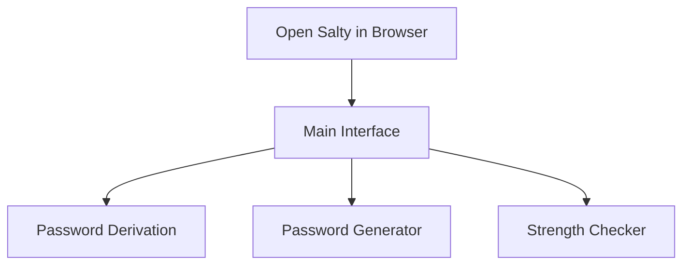

# Getting started with Salty

In this tutorial, you learn how to use Salty for secure password derivation and sharing. By the 
end, you have generated your first secure password and understand how to share encrypted data 
safely.

## Prerequisites

- A modern web browser (Chrome, Firefox, Safari, or Edge)
- Basic understanding of password security concepts
- Access to a Salty instance (or use the public instance at https://salty.esolia.pro)

## What you'll learn

- How to derive a secure password from a master password
- How to generate strong random passwords
- How to share encrypted payloads securely
- How to verify password strength

## Step 1: Access Salty

Navigate to your Salty instance in a web browser. You see the main interface with several 
sections:

1. **Password Derivation** (top section)
2. **Password Generator** (middle section)
3. **Password Strength Checker** (bottom section)



## Step 2: Derive your first password

Let's create a secure password for a specific site using password derivation.

1. In the **Key** field, enter a memorable phrase. This is your master password.
   ```
   Example: my-secret-phrase-2024
   ```

2. In the **Salt** field, enter the site or service name.
   ```
   Example: github.com
   ```

3. Click the **Salty!** button.

**Expected output:**
```
A unique, secure password appears in the result field.
The password is deterministic - same inputs always produce the same output.
```

### Understanding what happened

Salty used your key and salt to generate a unique password through:
1. PBKDF2-SHA512 key derivation (600,000 iterations)
2. AES-GCM-256 encryption
3. basE91 encoding for the final output

The server never sees your master password - all operations happen in your browser!

## Step 3: Generate a Random Password

Sometimes you need a completely random password instead of a derived one.

1. Scroll to the **Password Generator** section
2. Adjust the settings:
   - **Length**: Set your desired password length (default: 20)
   - **Include uppercase**: Toggle for A-Z characters
   - **Include lowercase**: Toggle for a-z characters
   - **Include numbers**: Toggle for 0-9 digits
   - **Include symbols**: Toggle for special characters

3. Click **Generate** to create a random password

**Example configuration:**
```
Length: 24
✓ Include uppercase
✓ Include lowercase
✓ Include numbers
✓ Include symbols
```

**Expected output:**
```
Example: K9#mP2$vN8@rL5^qT1&wX3!
```

## Step 4: Check Password Strength

Let's verify the strength of your generated passwords.

1. Copy any password you've created
2. Paste it into the **Password Strength Checker** field
3. View the real-time strength analysis

**Strength indicators:**
- **Entropy**: Measured in bits (higher is better)
- **Strength bar**: Visual representation
- **Time to crack**: Estimated time for various attack scenarios
- **Feedback**: Specific suggestions for improvement

## Step 5: Share an Encrypted Payload

Salty can also encrypt and share sensitive data securely.

1. Click the **Encrypt/Decrypt** toggle to switch modes
2. In the **Payload** field, enter the text you want to encrypt:
   ```
   Example: API_KEY=sk-1234567890abcdef
   ```

3. Enter a strong key in the **Key** field
4. Click **Salty!** to encrypt

**Expected output:**
```
An encrypted string like: yXJ%8Kd#mP9$vN2@rL5...
```

### Sharing the Encrypted Data

1. Copy the encrypted output
2. Share it with your recipient (via email, chat, etc.)
3. Separately and securely share the key (never in the same channel!)

### Decrypting Shared Data

When you receive encrypted data:

1. Ensure **Encrypt/Decrypt** is set to decrypt mode
2. Paste the encrypted payload
3. Enter the shared key
4. Click **Salty!** to decrypt

## Step 6: Use URL Parameters (Advanced)

Salty supports URL parameters for integration with other tools:

```
https://salty.example.com/?payload=yXJ%8Kd%23mP9%24vN2
https://salty.example.com/?sui=1
```

- `?payload=`: Pre-fills the payload field
- `?sui=1`: Activates "sharing UI" mode (hides generator and strength checker)

## Summary

You've successfully learned how to:
- ✓ Derive deterministic passwords from a master password
- ✓ Generate strong random passwords with custom requirements
- ✓ Check password strength with detailed analysis
- ✓ Encrypt and decrypt sensitive data for secure sharing
- ✓ Use URL parameters for integration

## Security Best Practices

1. **Never share your master password** - Keep it completely private
2. **Use unique salts** - Different salt for each site/service
3. **Share keys securely** - Use a different channel than the encrypted data
4. **Verify the URL** - Ensure you're on the correct Salty instance
5. **Use HTTPS only** - Never use Salty over unencrypted connections

## Next Steps

- Try the [How to Configure Security Settings](../how-to/configure-security.md) guide
- Learn about [Salty's Security Architecture](../explanation/security-architecture.md)
- Deploy your own instance with the [Deploying Salty](./deploying-salty.md) tutorial
- Explore the [API Reference](../reference/api.md) for programmatic access

## Troubleshooting

**Problem**: Password doesn't match what I generated before
**Solution**: Ensure you're using the exact same key and salt (case-sensitive)

**Problem**: Decryption fails with an error
**Solution**: Verify the key is correct and the payload hasn't been modified

**Problem**: Page seems slow or unresponsive
**Solution**: The 600,000 PBKDF2 iterations are CPU-intensive by design. This is a security feature, not a bug.

## Getting Help

If you encounter issues:
1. Check the browser console for error messages
2. Verify you're using a supported browser
3. Report issues on [GitHub](https://github.com/esolia/salty.esolia.pro-dd/issues)